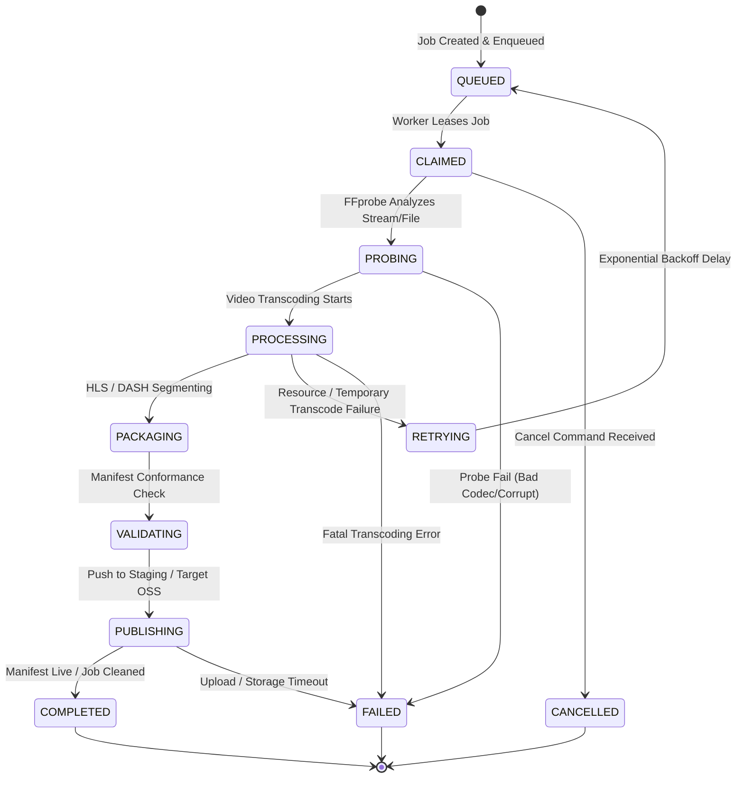

# GNTV DIGITAL — Media Processing & Packaging Engineering Blueprint

**Module:** 5 — Distribution, Streaming & Geo-Fencing Platform
**Sprint:** 5.3 — Media Processing & Packaging
**Date:** July 22, 2026
**Document Status:** APPROVED / SPRINT 5.3 IMPLEMENTATION AUTHORITY
**Implementation Constraint:** MEDIA PROCESSING AND LOCAL ATOMIC PACKAGING ONLY

---

## 1. Media Job Lifecycle Specification

The platform orchestrates media processing through a structured job lifecycle state machine. State changes are persisted to the database and emitted as async event payloads.



### State Definitions & Database Guard Rules
* **QUEUED**: Job record created in PostgreSQL with unique `idempotency_key`, enqueued to the corresponding Celery queue by priority.
* **CLAIMED**: Worker retrieves the job, updates `worker_id` and sets `lease_expires_at` to $30\text{s}$. If lease is not renewed by worker heartbeat, job is reclaimed by the reconciliation engine.
* **PROBING**: Worker invokes `ffprobe` to validate container, metadata, pixel format, audio mapping, and frame structure.
* **PROCESSING**: Multi-variant video transcoder active. Real-time encoding parameters are parsed from the worker output.
* **PACKAGING**: Stream segmented into aligned HLS `.ts` slices and DASH `.m4s` fragments.
* **VALIDATING**: Verification script checks manifest parsing, GOP boundary alignment, and segment sequence.
* **PUBLISHING**: Master manifest and media segments written atomically to the destination OSS storage.
* **COMPLETED**: Active lease released, temporary disk workspace purged, success audit log registered.
* **RETRYING**: State assigned on recoverable errors. Retries increment `attempt` counter and trigger exponential backoff.
* **FAILED**: Final terminal state. Error code, details, and call stack are logged. Stale segments are quarantined.
* **CANCELLED**: Operator-requested termination. Active worker process killed, resources reclaimed, state set to terminal.

---

## 2. FFmpeg Orchestration Design

### 2.1 Safe Command Construction
FFmpeg commands must be constructed programmatically as arguments lists to avoid shell injection vulnerabilities.
* **Command Executor**: Direct invocation of binary via Python's `asyncio.create_subprocess_exec()`.
* **Execution Constraint**: The parameter `shell=True` is strictly prohibited. Raw shell operators (`|`, `&`, `;`, `>`, `$()`) are blocked.
* **Execution Template**:
  ```python
  args = [
      "-hide_banner", "-y",
      "-i", input_source_path,
      # Programmatic filter complex construction
      "-filter_complex", filter_complex_string,
      # Mappings and encodings
      *encoding_arguments_list,
      output_manifest_path
  ]
  process = await asyncio.create_subprocess_exec(
      "ffmpeg", *args,
      stdout=asyncio.subprocess.PIPE,
      stderr=asyncio.subprocess.PIPE
  )
  ```

### 2.2 Process Isolation & Resource Limits
* **Namespace Isolation**: Each transcode worker executes inside a dedicated Docker container namespace.
* **cgroups Boundaries**: Container limits enforced at the orchestrator layer (Kubernetes CPU quota: 4.0 cores, Memory limit: 8Gi).
* **Disk I/O Quotas**: Write limits enforced on temporary processing directories using XFS project quotas (max 50GB workspace).

### 2.3 Timeout, Cancellation & Exit-Code Handling
* **Stuck Process Detection**: FFmpeg processes are governed by a global timeout wrapper (`asyncio.wait_for`). The timeout is computed dynamically based on media duration or stream heartbeat (VOD Timeout: $2 \times \text{Duration}$, Live Timeout: 15s without progress).
* **Graceful Termination**: Cancellation triggers a sequential shutdown:
  1. Issue `SIGTERM` to the FFmpeg process group.
  2. Wait 3.0 seconds for process cleanup.
  3. If still active, issue `SIGKILL` to force termination.
* **Exit-Code Verification**:
  * Exit code `0` is verified for job success.
  * Non-zero exit codes raise a structured `FFmpegExecutionError` detailing the exit code and final stderr lines.

### 2.4 Stderr Stream Parsing Engine
Workers parse the FFmpeg stderr stream asynchronously line-by-line using a non-blocking reader loop:
* **Progress Tracking Patterns**: Regex matching captures `frame=`, `fps=`, `q=`, `size=`, `time=`, `bitrate=`, `speed=`, and `drop=`.
* **Telemetry Publishing**: Parsed values are written to Redis every 2.0 seconds, updating the live stream dashboard with encoding performance and latency.

---

## 3. Worker Topology

The processing plane separates execution workloads into six dedicated worker queues:

```
                  ┌───────────────────────────────┐
                  │      Celery Message Broker    │
                  └──────────────┬────────────────┘
                                 │
         ┌───────────────┬───────┴───────┬───────────────┐
         ▼               ▼               ▼               ▼
 ┌──────────────┐┌──────────────┐┌──────────────┐┌──────────────┐
 │transcode-cpu ││transcode-acc ││   manifest   ││  thumbnail   │
 └──────────────┘└──────────────┘└──────────────┘└──────────────┘
         │               │               │               │
  (Encoding CPU)  (Encoding GPU)  (HLS/DASH/KMS)  (Keyframes/VTT)
```

* **`transcode-cpu`**: Handles standard live transcoding and VOD processing utilizing `libx264` and `libfaac`. Runs on standard compute nodes.
* **`transcode-accelerated`**: Directs high-throughput live encoding streams to GPU-enabled worker nodes equipped with NVIDIA NVENC or Intel QSV hardware.
* **`manifest`**: Generates and updates HLS multi-variant master playlists, child media playlists, and DASH MPD manifests. Optimized for high I/O speed.
* **`thumbnail`**: Extracts keyframe images, creates preview sprites, and compiles WebVTT track files for visual scrub bars.
* **`recording`**: Assembles, validates, and uploads archived live streams to permanent OSS VOD storage.
* **`maintenance`**: Scans workspace folders for stale temporary files, processes dead-letter queues, and quarantines failed transcode assets.

---

## 4. CPU & GPU Encoding Profiles

### 4.1 CPU Profile (libx264)
* **Video Codec**: `libx264` (H.264 / AVC).
* **Audio Codec**: `aac` (Advanced Audio Coding).
* **Preset**: `medium` (balance between compression efficiency and encode speed).
* **Tune**: `zerolatency` for live; `film` for VOD archives.
* **Pixel Format**: `yuv420p` (8-bit 4:2:0 chroma subsampling for legacy device compatibility).

### 4.2 GPU Profile (NVIDIA NVENC)
* **Video Codec**: `h264_nvenc`.
* **Hardware Preset**: `p4` (medium speed/quality balance) or `p1` (lowest latency).
* **Zero-Copy Pipeline**: Video scaling and pixel conversion performed entirely in GPU memory using CUDA hardware frames (`scale_cuda`).
* **NVENC Constraints**: Concurrency capped at 3 simultaneous encode sessions per GPU card to prevent hardware thread exhaustion.

### 4.3 Intel QSV & VAAPI Ingest Boundaries
* **Intel Quick Sync Video**: Supported via `h264_qsv` codec. Dedicated VAAPI device initialization (`-init_hw_device vaapi=va0:/dev/dri/renderD128`) required before mapping stream filters.
* **Hardware Capability Check**: Workers execute a startup diagnostic command on boot:
  `ffmpeg -ldecodectool | grep h264_nvenc`
  If hardware acceleration fails self-check, the worker notifies the broker, changes its queue registration, and falls back gracefully to `transcode-cpu`.

---

## 5. Approved Adaptive Bitrate (ABR) Ladder

The encoding profiles must strictly adhere to the following adaptive bitrate specification:

| Rendition | Resolution | Video Bitrate | Max Video Bitrate | Buffer Size | Frame Rate | GOP Size | Codec Profile | Level |
| :--- | :---: | :---: | :---: | :---: | :---: | :---: | :---: | :---: |
| **1080p** | $1920 \times 1080$ | 4500 kbps | 4800 kbps | 9000 kbps | 29.97 fps | 60 frames | High | 4.1 |
| **720p** | $1280 \times 720$ | 2200 kbps | 2400 kbps | 4400 kbps | 29.97 fps | 60 frames | Main | 3.1 |
| **480p** | $854 \times 480$ | 800 kbps | 900 kbps | 1600 kbps | 29.97 fps | 60 frames | Baseline | 3.0 |

* **Audio Configuration**:
  * 1080p: Stereo, AAC-LC, 192 kbps, $48\text{kHz}$ sampling.
  * 720p: Stereo, AAC-LC, 128 kbps, $48\text{kHz}$ sampling.
  * 480p: Stereo, AAC-LC, 96 kbps, $44.1\text{kHz}$ sampling.
* **Keyframe Constraints**: Keyframe interval must be set to exactly 2.0 seconds (`-g 60` at 29.97 fps) with scene-cut detection disabled (`-sc_threshold 0`) to ensure perfect segment alignment across all profiles.

---

## 6. HLS Packaging Design

* **Target Segment Length**: Exactly 6.0 seconds (`-hls_time 6`).
* **Segment Type**: MPEG-2 Transport Stream (`.ts`) for video; fragmented MP4 (`.fmp4`) when low-latency HLS is configured.
* **Manifest Directives**:
  * Variant playlists must declare `#EXT-X-INDEPENDENT-SEGMENTS` to indicate that every segment starts with an IDR keyframe.
  * Master playlist (`master.m3u8`) links variant playlists (`stream_1080p/index.m3u8`, `stream_720p/index.m3u8`, etc.) with accurate `BANDWIDTH`, `AVERAGE-BANDWIDTH`, `RESOLUTION`, and `CODECS` tags.
* **Atomic Publication**:
  1. Workers upload new media segments (`data_001.ts`) to temporary storage.
  2. Workers upload updated variant playlists.
  3. Master playlist is uploaded last.
  This sequence prevents player clients from fetching manifests referencing non-existent video segments.
* **Key Delivery Compatibility**: Playlist formats support `#EXT-X-KEY` tags specifying `METHOD=AES-128`, URI pointing to the token-gated KMS key service, and the initialization vector (IV).

---

## 7. MPEG-DASH Packaging Design

* **Manifest File**: Media Presentation Description (`.mpd`).
* **Structure**:
  * Single period for VOD; dynamic sliding periods for live stream broadcasts.
  * Separate `AdaptationSet` blocks for video representations (1080p, 720p, 480p) and audio representations (192k, 128k, 96k).
* **Representation Alignment**: Strict alignment of segment timelines across representations. Frame structures must share matching timescales and segment offsets.
* **Segment Template**: Uses segment template syntax with timescale and timeline indexing:
  `$RepresentationID$/media-$Number$.m4s`
* **Validation**: Generated MPD manifests must pass XML Schema validation against the schema target:
  `urn:mpeg:dash:schema:mpd:2011`

---

## 8. Storage Layout & Path Structure

All streaming files must reside inside a structured bucket layout to enable deterministic path resolution and partition cleanup:

```
[ OSS Private Streaming Bucket ]
  ├── tenant_gntv/
  │     └── channels/
  │           └── {channel_id}/
  │                 └── sessions/
  │                       └── {session_id}/
  │                             ├── master.m3u8
  │                             ├── manifest.mpd
  │                             ├── stream_1080p/
  │                             │     ├── index.m3u8
  │                             │     ├── data_001.ts
  │                             │     └── init.mp4
  │                             └── thumbnails/
  │                                   ├── keyframe_001.jpg
  │                                   └── sprite.vtt
```

* **Temporary Workspace Path**: Workers utilize a fast SSD local mount `/tmp/gntv-transcode/{job_id}/` for FFmpeg execution. This scratch space is purged atomically upon job completion or failure.
* **Final Output Paths**: Finalized assets are synced to the private OSS streaming bucket under the respective session directory.

---

## 9. Processing Contracts & Payloads

### 9.1 Celery Transcode Task Payload
```json
{
  "job_id": "job_9f8e7d6c-5b4a-3b2c-1d0e-9f8e7d6c5b4a",
  "idempotency_key": "idem_ch01_transcode_202607221615",
  "job_type": "live_transcode",
  "input_url": "rtmp://127.0.0.1:1935/live/ch01_active",
  "renditions": ["1080p", "720p", "480p"],
  "output_prefix": "tenant_gntv/channels/ch01/sessions/sess_20260722/",
  "aes_encryption": {
    "enabled": true,
    "key_url": "https://api.gntv.tv/api/v1/streaming/playback/key/ch01",
    "iv": "0x000102030405060708090a0b0c0d0e0f"
  },
  "max_attempts": 3,
  "attempt": 1
}
```

### 9.2 Event Bus Payloads (Redis Pub/Sub)
Workers emit events to the `gntv.events.processing` channel during execution:

* **Event: `job.processing`**
  ```json
  {
    "event_id": "evt_p1o2i3u4",
    "event_type": "job.processing",
    "job_id": "job_9f8e7d6c-5b4a-3b2c-1d0e-9f8e7d6c5b4a",
    "timestamp": "2026-07-22T16:17:00.000Z",
    "metrics": {
      "fps": 29.97,
      "speed_factor": 1.02,
      "frame_drops": 0,
      "current_time_ms": 120500
    }
  }
  ```

---

## 10. Reliability & Recovery Design

* **Retry Policy**: Recoverable errors (network timeouts, storage writes) trigger task retries with exponential backoff and jitter:
  $$\text{Delay} = \min(2^{\text{attempt}} \times 5, 300) + \text{random\_jitter}$$
* **Poison-Job Isolation**: Jobs exceeding `max_attempts` (default: 3) are marked `failed`, moved to the dead-letter registry, and quarantined. An alert is sent to operations.
* **Partial-Output Cleanup**: If a job fails or is cancelled, the worker runs a cleanup routine deleting all temporary `.ts` segments and partial manifest files associated with that job ID in the storage bucket before releasing the lock.
* **Idempotent Reprocessing**: Reconciliation workers check active jobs against Redis lock leases. If a worker goes offline, the lease expires, and the job is automatically returned to the `queued` state for acquisition by another worker.

---

## 11. Ingest Security & URL Sanitation

* **Input Allow-listing**: Ingest URLs are validated against a strict protocol allow-list (`rtmp://`, `rtmps://`, `srt://`). File-based sources are restricted to local temporary storage.
* **SSRF Protection**: Workers resolve ingest hosts using a secure DNS client. Requests to loopback addresses (`127.0.0.1`, `::1`), private subnets (`10.0.0.0/8`, `192.168.0.0/16`), or metadata servers (`100.100.100.200` for Alibaba) are blocked.
* **Path Traversal Prevention**: Input/output keys are sanitized using safe path resolution (`pathlib.Path.resolve()`). Attempts to reference parent directories (`../`) cause immediate job failure.
* **Secret Scrubbing**: Logs and error messages pass through a regex scrubbing filter that masks stream keys, JWT payloads, and access tokens before output:
  `re.sub(r'key=gntv_live_[a-zA-Z0-9]+', 'key=[REDACTED_STREAM_KEY]', log_line)`

---

## 12. Observability & Telemetry Metrics

Workers expose the following metrics to Prometheus and SLS:

* **`processing_duration_seconds`**: Total active transcoding runtime per job.
* **`queue_wait_time_seconds`**: Elapsed time between job enqueue (`QUEUED`) and worker lease (`CLAIMED`).
* **`encoding_speed_factor`**: Ratio of processed media time to actual execution time (Alert if $< 1.0$ for live streams).
* **`dropped_frames_total`**: Cumulative frame drops reported by FFmpeg.
* **`segment_latency_seconds`**: Time elapsed between segment generation and successful upload confirmation at OSS origin.
* **`manifest_freshness_seconds`**: Age of the master manifest update timestamp (Alert if $> 12$ seconds for live feeds).

---

## 13. Testing Specification

Sprint 5.3 implementation requires the following test suites:

* **Golden Manifest Verification**: Assertion tests validating that generated `.m3u8` and `.mpd` files contain required tags, matching sequence indices, and conform to HLS/DASH specifications.
* **Corrupt Input Resilience**: Integration tests validating that corrupt container formats, broken frames, or missing audio tracks fail gracefully with exit code `1` and clean up partial disk outputs.
* **Timeout & Recovery Integration**: Mock tests simulating slow network uploads; verifying that the job triggers retries and switches to fallback CPU queues if timeout thresholds are breached.
* **Forbidden-Boundary Lint Scan**: Automated static analysis scan verifying that no controller files, API routers, or consumer routes import `subprocess`, call `os.system()`, or perform media transcoding in-process.

---

## 14. Explicit Sprint 5.3 Boundaries

### 14.1 Allowed Scope
* FFmpeg command builders and execution wrappers (`asyncio.subprocess`).
* Transcoder worker daemon queues (`transcode-cpu` and `transcode-accelerated`).
* HLS (`.m3u8`) and DASH (`.mpd`) packaging logic.
* Provider-neutral local atomic publication and deterministic storage layouts. Alibaba OSS upload adapters remain deferred.
* Manifest validator checks.
* Processing telemetry metrics.

### 14.2 Prohibited Scope (Deferred to Sprint 5.4+)
* Public consumer playback endpoints (`/api/v1/streaming/playback/*`).
* DRM license key generation or exchange service.
* Multi-CDN edge routing or live traffic redirection.
* entititlement verification or billing logic.

---

## 15. Sign-Off & Verdict

This document is approved as the engineering blueprint for Sprint 5.3.

The Sprint 5.3 implementation authorization explicitly excludes playback, DVR/catch-up TV, CDN publishing, Alibaba SDK integration, DRM, billing, and multi-CDN routing. The implementation therefore stops at validated, atomically published local media generations.

```text
READY FOR SPRINT 5.3 IMPLEMENTATION
```

*Signed,*
**Chief Architect & Technical Director (CTO)**
**GNTV DIGITAL Platform**
