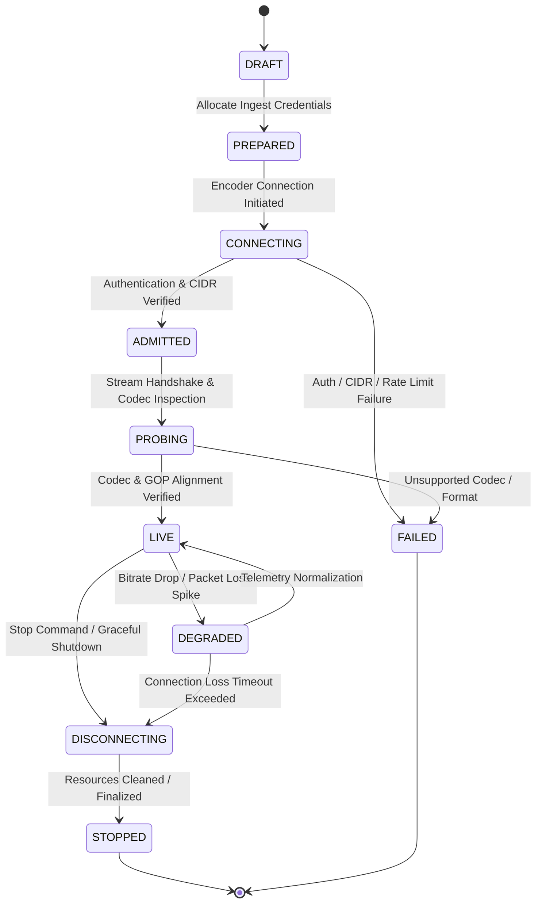

# GNTV DIGITAL — Streaming Ingest Platform Engineering Blueprint

**Module:** 5 — Distribution, Streaming & Geo-Fencing Platform
**Sprint:** 5.2 — Streaming Ingest Platform Architecture & Design
**Date:** July 21, 2026
**Document Status:** APPROVED / SPRINT 5.2 IMPLEMENTATION AUTHORITY
**Implementation Constraint:** INGEST CONTROL PLANE ONLY — MEDIA PROCESSING AND DELIVERY ENGINES PROHIBITED

---

## 1. Executive Summary & Architectural Scope

This document specifies the technical design for the **GNTV DIGITAL Streaming Ingest Platform** (Module 5, Sprint 5.2). It details the protocol specifications, authentication controls, session state machines, task orchestration workflows, resilience patterns, deployment topologies, and cloud integration boundaries required to ingest live broadcast streams into the platform.

```
┌───────────────────────────────────────────────────────────────────────────────────┐
│                           CONTRIBUTION INGEST LAYER                               │
│                                                                                   │
│  ┌─────────────────────────┐  RTMP / RTMPS   ┌─────────────────────────────────┐  │
│  │ ATEM Hardware / Encoder ├────────────────►│ Stream Gateway (Alibaba Apsara/ │  │
│  └─────────────────────────┘                 │ Self-Managed Nginx-RTMP Engine) │  │
│  ┌─────────────────────────┐  SRT / Caller   └────────────────┬────────────────┘  │
│  │ Kiloview / OBS Studio   ├──────────────────────────────────┘                   │
│  └─────────────────────────┘                                                      │
└───────────────────────────────────────────────────────────────────────────────────┘
                                                                │
                                              (Authentication & Admission)
                                                                │
                                                                ▼
┌───────────────────────────────────────────────────────────────────────────────────┐
│                             CONTROL & QUEUE PLANE                                 │
│                                                                                   │
│  ┌─────────────────────────┐                 ┌─────────────────────────────────┐  │
│  │   FastAPI Control API   │                 │   Redis Coordination Layer      │  │
│  │  (/api/v1/streaming/*)  │                 │ (Leases, Sessions, Event Bus)   │  │
│  └────────────┬────────────┘                 └────────────────┬────────────────┘  │
│               │                                               │                   │
│               ▼                                               ▼                   │
│  ┌─────────────────────────┐                 ┌─────────────────────────────────┐  │
│  │  PostgreSQL Metadata DB │                 │ Celery Worker Queues            │  │
│  │   (Durable Truth)       │                 │ (`stream-control`, `transcode`) │  │
│  └─────────────────────────┘                 └─────────────────────────────────┘  │
└───────────────────────────────────────────────────────────────────────────────────┘
```

---

## 2. Ingest Architecture & Protocol Specifications

### 2.1 RTMP / RTMPS Ingest Protocol Specification

* **Transport & Port**: Standard RTMP over TCP on port `1935`; encrypted RTMPS over TLS 1.3 on port `443` or `465`.
* **Ingest URI Syntax**:
  $$\text{rtmps://ingest.gntv.tv:443/live/}\{channel\_code\}?key=\{stream\_key\}$$
* **Handshake & Admission Sequence**:
  1. Encoder initiates TCP 3-way handshake followed by RTMP C0/C1/C2 handshake.
  2. Encoder sends `connect('live')` command object.
  3. Stream Gateway extracts `channel_code` and `stream_key` from the publish stream request.
  4. Stream Gateway verifies credentials against the low-latency Redis cache ($< 5\text{ms}$).
  5. If valid, Stream Gateway issues `NetStream.Publish.Start`; if invalid, issues `NetStream.Publish.BadName` and closes TCP socket.
* **Stream Constraints**:
  * Mandatory H.264 (AVC) Baseline/Main/High Profile video.
  * AAC-LC or HE-AAC audio.
  * Maximum video bitrate: 10,000 kbps; Maximum audio bitrate: 320 kbps.

### 2.2 SRT (Secure Reliable Transport) Ingest Specification

* **Transport & Port**: UDP-based SRT protocol on port `9000` (configurable port range `9000-9050`).
* **Mode Topology**: Stream Gateway acts as **SRT Listener**; encoders operate as **SRT Caller**.
* **StreamID Key Syntax**:
  $$\text{srt://ingest.gntv.tv:9000?streamid=gntv/live/}\{channel\_code\}/\{stream\_key\}$$
* **SRT Parameters**:
  * **Passphrase Encryption**: AES-128 / AES-256 encryption using PBKDF2 passphrase derived from the stream key.
  * **Latency Buffer**: Default $120\text{ms}$ (configurable up to $2000\text{ms}$ for high-jitter remote links).
  * **Max Bandwidth Overhead**: 25% overhead allocation for ARQ (Automatic Repeat reQuest) packet retransmission.
* **Telemetry Collection**: Real-time extraction of SRT stats (RTT, packet loss %, retransmitted packets, byte rate, send/receive buffer capacity) every $1000\text{ms}$.

---

## 3. Stream Authentication, Keys & Encoder Registration

### 3.1 Stream Authentication Architecture

```
[ Ingest Stream Request ] ──► [ Stream Gateway ] ──► [ Redis Cache Lookup ]
                                                             │
                                                    (Cache Miss / Stale)
                                                             │
                                                             ▼
                                                    [ PostgreSQL Lookup ]
                                                             │
                                                    (Validate HMAC Hash)
                                                             │
                                                             ▼
                                                    [ Populate Redis Cache ]
```

1. **Authentication Cache**: Stream keys are cached in Redis under `auth:stream_key:{channel_code}` with a 300-second TTL.
2. **One-Way Cryptographic Hashing**: Raw stream keys are never stored in database columns. The database stores `secret_hash` computed via HMAC-SHA256 with a system key derivation secret.
3. **Constant-Time Verification**: Secret comparison uses constant-time string comparison (`hmac.compare_digest`) to prevent timing side-channel attacks.

### 3.2 Stream Key Management

* **Format**: Prefix-based 32-character hexadecimal string (`gntv_live_livechannel01_a9f8e7d6c5b4...`).
* **Rotation Policy**:
  * Manual operator rotation via `POST /api/v1/streaming/channels/{id}/rotate-key`.
  * Automated rotation schedule (e.g. 90-day expiry).
  * Overlapping grace period (configurable up to 60 minutes) where both old and new keys remain valid during encoder re-configuration.
* **CIDR Restrictions**: Optional IP subnet whitelist (`allowed_cidrs`) stored on `stream_keys` entity to restrict contribution sources to studio IP ranges.

### 3.3 Encoder Registration & Device Profiling

To ensure hardware compatibility and auditability, contribution hardware devices must be registered in the platform database:

| Field | Type | Description |
| :--- | :--- | :--- |
| `device_id` | UUID | Unique hardware registration identifier |
| `name` | String | Operator label (e.g. "Studio A ATEM Mini Pro") |
| `hardware_vendor` | Enum | `blackmagic_atem`, `teradek`, `kiloview`, `obs_studio`, `generic_rtmp` |
| `mac_address` | String | Hardware MAC address for identification |
| `allowed_channel_id` | UUID | FK to `live_channels` |
| `max_bitrate_kbps` | Integer | Hard bandwidth cap for ingest streams from this device |
| `is_trusted` | Boolean | Bypasses secondary challenge checks |

---

## 4. Stream Lifecycle & Ingest Session State Machine

### 4.1 Ingest Session State Machine



### 4.2 State Transition Guard Rules

* `DRAFT` $\rightarrow$ `PREPARED`: Channel policy validated, stream key issued, ingest hosts assigned.
* `PREPARED` $\rightarrow$ `CONNECTING`: Ingest gateway receives TCP/UDP connection attempt.
* `CONNECTING` $\rightarrow$ `ADMITTED`: Redis/DB key check succeeds, CIDR check passes, single-publisher lock acquired.
* `ADMITTED` $\rightarrow$ `PROBING`: FFprobe / stream inspector reads first 2 seconds of video frames.
* `PROBING` $\rightarrow$ `LIVE`: H.264/AAC codec validated, GOP size $\le 120$ frames, audio sample rate $48.0\text{kHz}$ verified.
* `LIVE` $\rightarrow$ `DEGRADED`: Video frame rate drops below 20 fps or audio drift exceeds $500\text{ms}$ for over 10 consecutive seconds.
* `DEGRADED` $\rightarrow$ `LIVE`: Telemetry restores to normal baseline for 15 consecutive seconds.
* `LIVE` / `DEGRADED` $\rightarrow$ `DISCONNECTING`: TCP socket closed, SRT disconnect received, or explicit API `stop` command issued.
* `DISCONNECTING` $\rightarrow$ `STOPPED`: Manifest closed with `#EXT-X-ENDLIST` (if recording), active Redis lease removed, worker resources released.

### 4.3 Ingest Sessions Schema & Leases

Every active stream connection creates a temporary `PlaybackSession`/`IngestSession` lease stored in Redis:

```json
{
  "session_id": "9b1deb4d-3b7d-4bad-9bdd-2b0d7b3dcb6d",
  "channel_id": "c1f2e3d4-5a6b-7c8d-9e0f-1a2b3c4d5e6f",
  "stream_id": "a1b2c3d4-e5f6-7a8b-9c0d-1e2f3a4b5c6d",
  "protocol": "rtmps",
  "client_ip": "197.231.18.42",
  "encoder_vendor": "blackmagic_atem",
  "ingress_node": "ingest-node-01.nairobi.gntv.tv",
  "lease_expires_at": 1784572830,
  "heartbeat_interval_sec": 5,
  "reconnect_grace_sec": 15
}
```

---

## 5. Task Orchestration: Celery & Redis Message Flow

### 5.1 Celery Queue Architecture

```
                        ┌───────────────────────────────────┐
                        │      FastAPI / Ingest Gateway     │
                        └─────────────────┬─────────────────┘
                                          │
                               (Enqueue Async Tasks)
                                          │
                                          ▼
┌───────────────────────────────────────────────────────────────────────────────────┐
│                                 CELERY BROKER QUEUES                              │
│                                                                                   │
│  ┌───────────────────────────┐  Priority 1  ┌──────────────────────────────────┐  │
│  │   `stream-control` Queue  ├─────────────►│ Stream Admission & Stop Workers  │  │
│  └───────────────────────────┘              └──────────────────────────────────┘  │
│  ┌───────────────────────────┐  Priority 2  ┌──────────────────────────────────┐  │
│  │   `transcode-cpu` Queue   ├─────────────►│ FFmpeg Transcoder Pool (CPU)     │  │
│  └───────────────────────────┘              └──────────────────────────────────┘  │
│  ┌───────────────────────────┐  Priority 2  ┌──────────────────────────────────┐  │
│  │  `transcode-accelerated`  ├─────────────►│ FFmpeg Transcoder Pool (GPU)     │  │
│  └───────────────────────────┘              └──────────────────────────────────┘  │
│  ┌───────────────────────────┐  Priority 3  ┌──────────────────────────────────┐  │
│  │      `recording` Queue    ├─────────────►│ Segment Persistence & Finalize   │  │
│  └───────────────────────────┘              └──────────────────────────────────┘  │
└───────────────────────────────────────────────────────────────────────────────────┘
```

### 5.2 Redis Pub/Sub Event Bus Schemas

All stream state changes publish JSON event payloads to Redis Pub/Sub channels (`gntv.events.streaming`):

#### Event: `stream.connected`
```json
{
  "event_id": "evt_7f8e9d0c1b2a",
  "event_type": "stream.connected",
  "timestamp": "2026-07-21T17:15:00.000Z",
  "channel_id": "c1f2e3d4-5a6b-7c8d-9e0f-1a2b3c4d5e6f",
  "stream_id": "a1b2c3d4-e5f6-7a8b-9c0d-1e2f3a4b5c6d",
  "protocol": "rtmp",
  "client_ip": "102.218.45.12",
  "ingress_node": "ingest-node-01"
}
```

#### Event: `stream.started`
```json
{
  "event_id": "evt_1a2b3c4d5e6f",
  "event_type": "stream.started",
  "timestamp": "2026-07-21T17:15:02.500Z",
  "channel_id": "c1f2e3d4-5a6b-7c8d-9e0f-1a2b3c4d5e6f",
  "stream_id": "a1b2c3d4-e5f6-7a8b-9c0d-1e2f3a4b5c6d",
  "video_codec": "h264",
  "audio_codec": "aac",
  "resolution": "1920x1080",
  "frame_rate": 29.97,
  "bitrate_kbps": 4550,
  "gop_size": 60
}
```

#### Event: `stream.degraded`
```json
{
  "event_id": "evt_9a8b7c6d5e4f",
  "event_type": "stream.degraded",
  "timestamp": "2026-07-21T17:22:15.000Z",
  "channel_id": "c1f2e3d4-5a6b-7c8d-9e0f-1a2b3c4d5e6f",
  "stream_id": "a1b2c3d4-e5f6-7a8b-9c0d-1e2f3a4b5c6d",
  "reason": "dropped_frames_threshold_exceeded",
  "current_fps": 14.2,
  "expected_fps": 29.97,
  "packet_loss_pct": 8.4
}
```

---

## 6. Health Monitoring, Telemetry & Failure Recovery

### 6.1 Stream Health Telemetry Collector

* **Collection Window**: Telemetry metrics sampled every 2 seconds by ingest workers.
* **Metrics Tracked**:
  * **Input Video FPS**: Monitored via FFmpeg `-progress` pipe or SRT socket statistics.
  * **Bitrate Stability**: Moving average of video/audio ingest byte rates.
  * **Audio/Video Sync Offset**: PTS (Presentation Time Stamp) drift between audio and video streams (alert threshold $> 200\text{ms}$).
  * **Segment Duration Drift**: Variance in produced HLS 6-second segment sizes (alert threshold $> 7.5\text{s}$).

### 6.2 Primary / Backup Input Failover Logic

```
   ┌───────────────────────┐
   │ Primary RTMP Source   ├────────┐
   └───────────────────────┘        │
                                    ▼
                           ┌─────────────────┐       ┌──────────────────────┐
                           │ Ingest Selector ├──────►│ Active FFmpeg Worker │
                           └─────────────────┘       └──────────────────────┘
                                    ▲
   ┌───────────────────────┐        │
   │ Backup SRT Source     ├────────┘
   └───────────────────────┘
```

1. **Dual Ingestion**: Live channel supports active primary (`rtmps://ingest.gntv.tv/live/ch01_pri`) and secondary backup (`srt://ingest.gntv.tv:9000?streamid=ch01_sec`) destinations.
2. **Automatic Failover Trigger**:
   * If primary source experiences stream disconnect or video freeze for $> 5$ seconds.
   * Ingest Selector switches active transcode input to the secondary backup stream within $< 1.5$ seconds.
3. **Seamless GOP Switch**: Backup source MUST run in GOP-synchronized alignment with primary source to prevent player buffer resets.

---

## 7. Horizontal Scaling, Docker & Kubernetes Topology

### 7.1 Docker Multistage Container Topology

```dockerfile
# Container Image Target 1: gntv-stream-gateway
# Dedicated Lightweight RTMP/SRT Admission Engine
FROM nginx:1.25-alpine AS stream-gateway
# Install compiled Nginx RTMP module & SRT proxy tools
...

# Container Image Target 2: gntv-transcoder-worker
# Isolated FFmpeg Processing Engine
FROM ubuntu:24.04 AS transcoder-worker
RUN apt-get update && apt-get install -y ffmpeg python3 python3-pip
...
```

### 7.2 Kubernetes Deployment Topology (ACK / K8s)

```yaml
apiVersion: apps/v1
kind: Deployment
metadata:
  name: gntv-transcoder-cpu
  namespace: streaming
spec:
  replicas: 4
  strategy:
    type: RollingUpdate
    rollingUpdate:
      maxSurge: 1
      maxUnavailable: 0
  template:
    metadata:
      labels:
        app: gntv-transcoder
        tier: worker
        capability: cpu
    spec:
      affinity:
        podAntiAffinity:
          preferredDuringSchedulingIgnoredDuringExecution:
          - weight: 100
            podAffinityTerm:
              labelSelector:
                matchExpressions:
                - key: app
                  operator: In
                  values:
                  - gntv-transcoder
              topologyKey: kubernetes.io/hostname
      containers:
      - name: transcoder
        image: registry.gntv.tv/streaming/transcoder-worker:v0.5.2
        resources:
          requests:
            cpu: "2000m"
            memory: "4Gi"
          limits:
            cpu: "4000m"
            memory: "8Gi"
        env:
        - name: CELERY_QUEUE
          value: "transcode-cpu"
        - name: REDIS_URL
          valueFrom:
            secretKeyRef:
              name: gntv-redis-secrets
              key: url
```

### 7.3 Horizontal Pod Autoscaler (HPA) Specification

* **Metrics Trigger**: Autoscale `gntv-transcoder-cpu` pods based on custom Prometheus metric `celery_queue_depth{queue="transcode-cpu"}`.
* **Scale Up Policy**: If `celery_queue_depth > 5` for 30 seconds, scale up by +2 pods (max 16 pods).
* **Scale Down Policy**: Stabilize scale down over a 300-second stabilization window to prevent flapping during stream reconnects.

---

## 8. Security & Alibaba Cloud Integration Boundaries

### 8.1 Security & Network Controls

1. **Strict Transport Security**: All public HTTP/RTMP endpoints terminate TLS 1.3 with AES-GCM cipher suites.
2. **Private Network Isolation**: Transcoder worker pods and database clusters reside in isolated private subnets with no public IPv4 addresses assigned.
3. **Log Sanitation & Redaction**: Automated log scrubbing filter redacts stream keys, JWT bearer tokens, HMAC secrets, and customer IP addresses before exporting logs to Alibaba Simple Log Service (SLS).

### 8.2 Alibaba Cloud Service Boundaries

```
┌───────────────────────────────────────────────────────────────────────────────────┐
│                            ALIBABA CLOUD BOUNDARY                                 │
│                                                                                   │
│  ┌─────────────────────────┐  Ingress Push   ┌─────────────────────────────────┐  │
│  │ Hardware ATEM Encoder   ├────────────────►│ Alibaba ApsaraVideo Live Engine │  │
│  └─────────────────────────┘                 └────────────────┬────────────────┘  │
│                                                               │                   │
│                                                     (MNS Webhook Callback)        │
│                                                               │                   │
│                                                               ▼                   │
│  ┌─────────────────────────┐  Signed Put     ┌─────────────────────────────────┐  │
│  │ GNTV FastAPI Controller ├────────────────►│ Alibaba OSS Bucket              │  │
│  │ (Webhook Receiver)      │                 │ (`gntv-raw-uploads`)            │  │
│  └─────────────────────────┘                 └─────────────────────────────────┘  │
└───────────────────────────────────────────────────────────────────────────────────┘
```

* **ApsaraVideo Live Interface**: Operates as primary managed ingest engine for standard RTMP streams.
* **MNS Webhook Bridge**: ApsaraVideo event notifications (`StreamPublish`, `StreamPublishCut`, `RecordFinalize`) trigger HTTP callbacks to `/api/v1/streaming/callbacks/apsara`.
* **RAM Role Access Control**: Transcoder workers assume temporary Security Token Service (STS) RAM roles with write-only permissions targeting `gntv-raw-uploads` and `gntv-streaming-media` OSS buckets.

---

## 9. Architectural Verification & Sign-Off

This document constitutes the complete engineering blueprint for the GNTV Streaming Ingest Platform (Sprint 5.2).

* **Design Verification**: **PASSED**
* **Code Implementation**: **SPRINT 5.2 INGEST CONTROL-PLANE FOUNDATION AUTHORIZED**
* **Excluded Implementation**: **FFmpeg, HLS, DASH, recording, playback, transcoding, Alibaba SDK adapters, and media workers**
* **Blueprint Status**: **APPROVED**

*Signed,*
**Chief Architect & Technical Director (CTO)**
**GNTV DIGITAL Platform**
