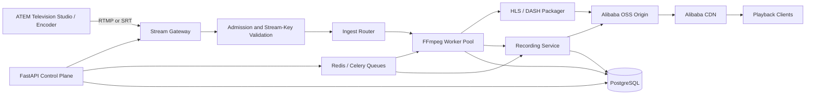
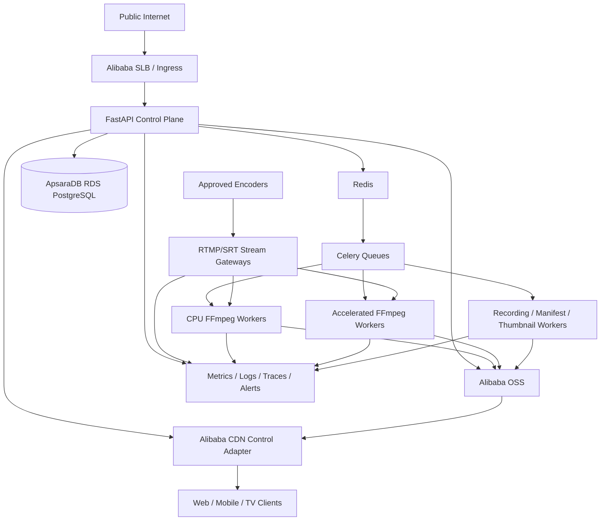
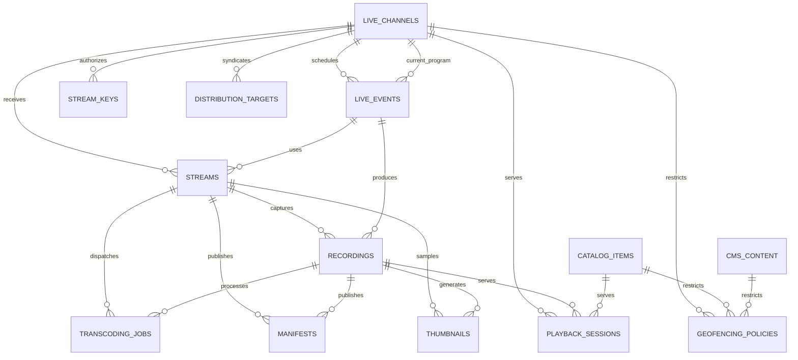

# GNTV DIGITAL — Streaming Platform Master Specification

**Module:** 5 — Distribution, Streaming & Geo-Fencing Platform
**Sprint:** 5.0 — Architecture Kickoff
**Date:** 2026-07-21
**Status:** APPROVED — READY FOR SPRINT 5.3 IMPLEMENTATION
**Implementation status:** SPRINT 5.3 MEDIA PROCESSING & PACKAGING AUTHORIZED
**Review source:** `docs/reports/module5_architecture_review.md`

## 1. Purpose and approval gate

This document defines the proposed architecture for GNTV DIGITAL live ingest, processing, recording, delivery, and playback. It is an architecture contract for review; it does not authorize application code, database migrations, cloud provisioning, or UI implementation.

Antigravity reviewed the first draft, required architectural changes, and approved the revised architecture on 2026-07-21. Sprint 5.1 is authorized only for the domain and contract foundation described in Section 13; media-engine implementation remains prohibited.

Sprint 5.0 can pass re-review only when Antigravity reviews scalability, security, performance, database design, API contracts, Alibaba integration, deployment strategy, and the documented blocker resolutions, then records one of these decisions:

```text
READY FOR SPRINT 5.1
```

or:

```text
REQUIRES CHANGES
```

The recorded `READY FOR SPRINT 5.1` gate authorizes models, migration, schemas, repositories, service interfaces, RBAC, route/OpenAPI registration, and unit tests. It does not authorize RTMP, SRT, FFmpeg, HLS/DASH packaging, Celery execution, Alibaba SDK integration, playback/recording engines, or streaming workers.

### Architecture review directive traceability

| Review directive | Architectural resolution in this revision | Implementation status |
|---|---|---|
| Pipeline syntax blocker | Section 2 records the exact two-symbol rename and makes a repository compile gate mandatory | Corrected and compile-verified in Sprint 5.1 |
| Worker decoupling | Sections 4, 5, 10, and 11 require dedicated Celery worker processes/containers and prohibit FFmpeg subprocesses in FastAPI | Boundary enforced; execution remains absent by scope |
| Database schema gaps | Section 7 adds `distribution_targets` and `geofencing_policies`, strengthens `live_channels` and `playback_sessions`, and updates relationships/constraints | Eleven models and migration foundation implemented in Sprint 5.1 |
| API contract gaps | Section 8 defines canonical `/api/v1/streaming` and `/api/v1/distribution` resources, callback verification, schema names, response models, and errors | Pydantic/OpenAPI routes implemented; services fail closed until later sprints |
| Media security enforcement | Section 9 specifies HMAC-SHA256 canonicalization and HLS AES-128 envelope encryption/key delivery | Contracts retained; cryptographic engine remains out of Sprint 5.1 scope |

## 2. Scope and architectural boundaries

### In scope

- RTMP and SRT contribution ingest.
- Stream admission, health, lifecycle control, and operator visibility.
- FFmpeg-based live transcoding and packaging.
- HLS and DASH manifest production.
- Live channel and event metadata.
- Recording capture and publication to Alibaba OSS.
- Playback authorization and Alibaba CDN delivery.
- Asynchronous job orchestration with Redis, Celery, and background workers.
- Operational monitoring, horizontal scaling, and automatic recovery.

### Out of scope for Sprint 5.0

- All production code and database migrations.
- Cloud resource provisioning or changes to live infrastructure.
- UI implementation.
- DRM vendor selection or license-server integration.
- Ad insertion, monetization, subscriptions, and entitlement billing.
- AI production, translation, transcription, or recommendation changes.

### Repository syntax prerequisite

The review identified a pre-existing fatal syntax error in `pipeline/pipeline_orchestrator.py`. Sprint 5.1 corrected both references atomically:

```diff
-class GNTV DIGITAL, ALL EVERYWHEREPipeline:
+class GNTVPipeline:

-    pipeline = GNTV DIGITAL, ALL EVERYWHEREPipeline()
+    pipeline = GNTVPipeline()
```

Acceptance evidence includes Python compilation validation for the orchestrator and a repository search proving the invalid identifier no longer exists. Renaming only the declaration or only the constructor call would have been insufficient.

### Existing platform ownership

- Auth remains the source of truth for users, JWT sessions, roles, and scopes.
- `cms_content` remains the source of truth for editorial content.
- `cms_media_files` remains the source of truth for durable media assets.
- Catalog remains the source of truth for consumer-facing titles, hierarchy, and personalization.
- Editorial remains the source of truth for approval and publication decisions.
- Module 5 owns stream runtime state, ingest credentials, processing jobs, live delivery metadata, recordings, manifests, and playback sessions.
- Module 5 references existing records by ID and must not duplicate their metadata graphs.

### Service boundary matrix

| Service | Owns | Depends on | Must not own |
|---|---|---|---|
| Stream Gateway | RTMP/SRT admission, connection leases, protocol telemetry, worker routing | Stream-key validation cache, stream control events | User identity, editorial metadata, catalog metadata, durable recordings |
| Stream Control Service | Stream lifecycle commands, durable runtime state, idempotency, audit coordination | Auth/RBAC, PostgreSQL, Redis/Celery | Media packet transport or synchronous FFmpeg execution |
| FFmpeg Worker Service | Probe, transcode, rendition alignment, segment production, worker telemetry | Gateway input, Celery, OSS | Public API authorization or consumer metadata |
| Live Channel Service | Channel operational configuration, state, policies, Catalog/CMS references | Catalog, CMS, Editorial publication state | Duplicate catalog or editorial records |
| Recording Service | Recording lifecycle, finalization, recovery, checksums, DAM linkage | Streams/events, OSS, Media Library | Canonical DAM asset metadata |
| Playback Service | Playback authorization, signed delivery response, session lifecycle | Auth, channel/recording state, CDN signing, policy rules | Segment proxying, transcoding, or CDN edge caching |
| Distribution Service | Outbound target configuration, encrypted credentials, syndication state, adapter commands | Live Channel Service, KMS, provider adapters, Celery | Plaintext target credentials or inline relay processes |
| Geo-Fencing Service | Territorial policy, effective windows, policy versions, CDN synchronization | CMS/Catalog/channel references, trusted geo context, CDN adapter | Client-supplied country truth or duplicate content metadata |
| Manifest Service | HLS/DASH generation metadata, validation, generation publication | FFmpeg output, OSS, CDN | Encoding decisions outside the approved profile |
| Thumbnail Service | Keyframes, posters, sprites, preview metadata | Recordings/streams, OSS, Media Library | Editorial artwork decisions |
| Monitoring/Reconciliation | Health aggregation, stale lease detection, state repair proposals, alerts | All runtime services and infrastructure telemetry | Silent destructive repair or unaudited state mutation |

## 3. Architecture principles

1. **Separate control plane from media data plane.** FastAPI manages metadata and commands; RTMP/SRT packets, transcoding, segments, and playback never flow through ordinary API workers.
2. **Asynchronous by default.** Start, stop, probe, transcode, package, record, and publish operations become jobs rather than long-running HTTP requests.
3. **PostgreSQL stores durable truth; Redis stores coordination state.** Redis is not the authoritative store for channel, recording, or job history.
4. **OSS is the durable media origin; CDN is the playback edge.** Clients must not depend on worker-local files.
5. **Every command is idempotent and auditable.** Retries must not create duplicate workers, recordings, or manifests.
6. **Credentials are least-privilege and rotatable.** Stream keys and signing secrets are never stored in plaintext.
7. **Failure is an explicit state.** Health, retry count, last error, and operator recovery actions must be observable.
8. **Protocol and provider adapters remain replaceable.** Alibaba integration is behind interfaces so local and test adapters can be deterministic.

## 4. Architecture overview and streaming architecture

The Stream Gateway is a logical boundary, not a requirement to place a custom Python process in the media path. The reviewed production default is Alibaba ApsaraVideo Live for supported RTMP/SRT admission and recording events, fronted by GNTV key/policy synchronization and callback validation. A self-managed gateway is retained only as an approved fallback for protocol, regional, or failover requirements that ApsaraVideo Live cannot satisfy. Provider capability and regional availability must be proven in staging before topology approval.



### 4.1 RTMP ingest

- Accept standard encoder contribution on a dedicated ingest hostname and port, isolated from the public API.
- Resolve application/channel plus stream key before admitting a publisher.
- Enforce one active publisher per stream unless an explicit redundant-input policy is enabled.
- Capture connection time, source address, protocol, codec probe, bitrate, resolution, frame rate, audio properties, and disconnect reason.
- Reject invalid, revoked, expired, or rate-limited keys before starting FFmpeg work.
- Terminate TLS at an RTMPS-capable edge when supported; raw RTMP is restricted to approved networks or secure tunnels.

### 4.2 SRT ingest

- Support caller/listener mode through a dedicated SRT listener pool.
- Require encrypted SRT passphrases and validated stream identifiers.
- Record latency, packet loss, retransmissions, round-trip time, and receiver buffer health.
- Normalize an admitted SRT input into the same internal stream lifecycle used by RTMP.
- Keep SRT listeners horizontally scalable through deterministic channel assignment or a gateway load-balancing layer.

### 4.3 Stream Gateway

The Stream Gateway is the media-plane admission boundary. It must:

- Validate stream keys through a low-latency cache backed by PostgreSQL.
- Apply connection, IP, channel, and key rate limits.
- Emit `stream.connected`, `stream.started`, `stream.degraded`, `stream.disconnected`, and `stream.failed` events.
- Route the accepted input to an assigned worker without copying media through FastAPI.
- Maintain short-lived heartbeats and leases in Redis.
- Reject duplicate publishers or apply the approved primary/backup failover policy.
- Avoid logging complete stream keys, signed URLs, or playback tokens.

### 4.4 FFmpeg Workers

- FFmpeg is executed only by dedicated worker processes in isolated CPU/GPU containers or pods. FastAPI processes may persist and enqueue commands but must never invoke, wait for, supervise, or pipe an FFmpeg subprocess.
- Workers consume dedicated high-cost queues and acquire a lease for one stream/job.
- Input is probed before processing; unsupported codecs or invalid media fail with a structured reason.
- Initial rendition policy is configurable per channel rather than hardcoded. A proposed baseline is source pass-through where safe plus 1080p, 720p, 480p, and audio-only variants where the source and capacity allow.
- GOP alignment and keyframe intervals must be consistent across variants to support adaptive switching.
- Workers produce temporary segments locally, upload completed objects to OSS, and publish manifests only after referenced objects exist.
- Heartbeats, progress, stderr summaries, exit code, CPU/GPU usage, and retry count are reported without exposing secrets.
- CPU and hardware-accelerated worker pools are separate queues with explicit capability labels.
- Worker-to-control-plane communication uses durable job state plus events/heartbeats; no worker depends on an open HTTP request.

The architecture-review baseline ABR ladder is:

| Profile | Resolution | Video bitrate | Audio bitrate | Frame rate | Segment duration | GOP |
|---|---:|---:|---:|---:|---:|---:|
| 1080p FHD | 1920×1080 | 4500 kbps | 192 kbps | 29.97 fps | 6 seconds | 60 frames |
| 720p HD | 1280×720 | 2200 kbps | 128 kbps | 29.97 fps | 6 seconds | 60 frames |
| 480p SD | 854×480 | 800 kbps | 96 kbps | 29.97 fps | 6 seconds | 60 frames |

This table is an architecture profile, not an FFmpeg implementation. Sprint 5.1 must validate source-frame-rate handling, aspect-ratio preservation, bandwidth overhead, codec/device compatibility, audio mapping, and GOP/segment alignment before turning it into executable worker configuration.

### 4.5 Live Channel Service

- Owns the operational configuration of each live channel.
- Links a channel to its Catalog record and optional Editorial content without duplicating those records.
- Controls ingest protocol policy, rendition profile, recording policy, availability, fallback slate, and primary/backup input behavior.
- Exposes channel state as `draft`, `ready`, `live`, `degraded`, `offline`, or `maintenance`.
- Converts gateway and worker events into durable channel health and audit records.

### 4.6 Recording Service

- Starts recording automatically by channel policy or explicitly by an authorized operator.
- Produces an immutable source/mezzanine reference plus delivery renditions where configured.
- Finalizes recordings only after duration, checksum, object existence, and manifest validation pass.
- Creates or links a `cms_media_files` asset after successful finalization.
- Supports partial-recording recovery after worker or network failure.
- Uses retention policies for temporary segments and never deletes durable assets as part of a retry.

### 4.7 Playback Service

- Resolves a published channel, event, recording, or catalog item into an authorized playback response.
- Checks publication state, regional rules, account/session state, device policy, and future entitlement hooks.
- Returns short-lived signed HLS/DASH URLs or a short-lived playback token; it does not proxy video segments.
- Creates and updates playback sessions for concurrency, analytics, resume position, and abuse detection.
- Returns a safe fallback/offline slate when channel policy permits.

## 5. Cloud architecture



### 5.1 Alibaba OSS

- Use a private streaming-media bucket as the durable origin.
- Suggested key layout: `live/{channel_id}/{stream_id}/{generation}/...` and `recordings/{recording_id}/...`.
- Enable server-side encryption, lifecycle rules, object versioning where required, access logging, and least-privilege RAM roles.
- Upload manifests last or use a generation-specific prefix so clients never read incomplete manifests.
- Temporary worker storage is disposable and must not be the only copy of finalized media.

### 5.2 Alibaba CDN

- Use OSS as a protected origin; client delivery occurs through approved CDN domains.
- Configure cache behavior separately for manifests, live segments, VOD segments, thumbnails, and error responses.
- Use signed URL/token authentication at the edge with short TTLs.
- Support purge/invalidation for emergency unpublish and channel shutdown.
- Preserve a multi-CDN/provider adapter boundary even if Alibaba CDN is the initial provider.
- Target a measured cache-hit ratio of at least 95% for immutable media segments.
- Initial review values are a 2-second edge TTL for live master/media playlists and a 24-hour TTL for finalized VOD playlists; versioned segments are immutable and use long TTLs. These values remain configuration, not source-code constants.
- Geo enforcement uses ISO 3166-1 alpha-2 country decisions synchronized from the authoritative policy database; denied requests return `403` without revealing unpublished metadata.

### 5.3 Redis

Redis is used for:

- Celery broker coordination.
- Short-lived stream-key validation cache.
- Gateway and worker heartbeats/leases.
- Rate-limit counters and idempotency keys.
- Ephemeral channel-health snapshots.
- Distributed locks with bounded TTLs.

Redis must not be the only store for stream history, recording state, or audit evidence.

### 5.4 PostgreSQL

- Stores durable configuration, lifecycle state, relational links, audit fields, job history, and playback-session metadata.
- Uses transactional state changes with optimistic locking where operators and workers may race.
- Uses indexes and time-based retention/partitioning for high-volume session and event tables.
- Remains private to application and worker networks with TLS required in production.
- Playback validation and catalog-heavy reads may use ApsaraDB read replicas only where replica lag cannot weaken revocation, concurrency, publication, or geo-policy enforcement; security-critical decisions read from the writer or an explicitly bounded-consistency cache.

### 5.5 Celery and background workers

- Celery is the selected initial application task system; Alibaba MNS may bridge Apsara/OSS events into idempotent Celery tasks but does not replace durable PostgreSQL state.
- Use separate queues: `stream-control`, `transcode-cpu`, `transcode-accelerated`, `recording`, `manifest`, `thumbnail`, and `maintenance`.
- Give live control and manifest work higher priority than offline thumbnail or maintenance tasks.
- Acknowledge long-running work only after state is durably recorded.
- Use bounded retries, exponential backoff with jitter, dead-letter handling, and idempotency keys.
- Workers must be independently deployable and horizontally scalable by queue depth and resource utilization.
- FastAPI and worker images may share versioned domain contracts, but run as different process types with separate resource limits, autoscaling, health checks, and deployment rollouts.
- Synchronous `subprocess`, `asyncio.create_subprocess_exec`, shell invocation, or in-process FFmpeg libraries are prohibited in API request handlers and API service methods.

## 6. Video pipeline

```text
Studio
  ↓
ATEM Television Studio
  ↓
RTMP / SRT
  ↓
Ingest Server
  ↓
FFmpeg
  ↓
HLS
  ↓
DASH
  ↓
OSS Storage
  ↓
Alibaba CDN
  ↓
Web / Android / iOS / Smart TV / Apple TV / Android TV
```

The HLS and DASH branches are logically parallel outputs from the packager; DASH is not generated from HLS. Both reference aligned encoded renditions. Client capability negotiation selects the appropriate manifest, codec, and DRM-free playback policy approved for Sprint 5.1.

### 6.1 HLS

- Produce an HLS multivariant master playlist plus one media playlist per approved video/audio rendition.
- Use aligned GOP/keyframe boundaries so clients can change rendition safely.
- Publish media objects before the playlists that reference them.
- Use short cache lifetimes for live playlists, longer immutable caching for versioned segments, and long caching for finalized VOD segments.
- Keep segment duration, playlist window, low-latency HLS support, codec set, subtitle layout, and discontinuity policy configurable until Sprint 5.1 approval.
- Validate playlist syntax, referenced-object existence, monotonic media sequence, target duration, rendition bandwidth, codecs, and final `ENDLIST` behavior for recordings.
- Never expose the private OSS origin URL; playback returns a CDN-signed URL or session-bound token.

### 6.2 MPEG-DASH

- Produce an MPD with adaptation sets for approved video, audio, and subtitle representations.
- Align periods, segment timelines, timestamps, and keyframes with the same encoded rendition family used for HLS.
- Publish initialization/media segments before the MPD generation that references them.
- Support dynamic MPDs for live playback and static MPDs for finalized recordings.
- Keep profile, minimum update period, time-shift buffer, availability start time, UTC timing, codec set, and segment-template policy configurable until Sprint 5.1 approval.
- Validate MPD schema/structure, representation metadata, initialization paths, segment availability, live-edge calculation, and static-finalization behavior.
- DASH is an independent packaging output; failure must not corrupt or roll back a healthy HLS presentation.

### Pipeline states

```text
requested → admitted → probing → starting → live → stopping → finalizing → stopped
                                      ↘ degraded
any non-terminal state → failed → retrying → previous safe state or terminal failed
```

### Processing guarantees

- State transitions are durable and auditable.
- Duplicate start/stop commands are idempotent.
- A manifest becomes public only after its referenced media exists.
- A recording is `ready` only after validation and OSS persistence.
- Emergency stop revokes playback access and requests CDN invalidation.
- Partial results remain quarantined until recovery or operator review.

## 7. Database design

All identifiers are UUIDs unless an existing referenced table uses another key type. Every mutable table includes `created_at`, `updated_at`, and an optimistic `lock_version` where concurrent writes are possible. Status fields use constrained enums or check constraints, not arbitrary text.

Sprint 5.1 implements migration `202607211200_cms_module_5_distribution.py`, following `202607131200`. It creates only the eleven approved foundation tables and is the single Alembic head. No media-engine data or worker execution is introduced.

Schema rules shared by all Module 5 tables:

- Foreign keys use explicit delete behavior; durable audit/history records are not cascade-deleted with operational resources.
- Secret values, session tokens, full IP addresses, and signed URLs are never stored as plaintext columns.
- Country codes are uppercase ISO 3166-1 alpha-2 values validated on write.
- JSON fields are reserved for bounded, schema-validated metadata; query-critical relationships and states use relational columns.
- Exactly-one-target constraints protect polymorphic playback and geo-policy references.
- High-volume playback sessions are eligible for time partitioning after measured thresholds are approved.

Implemented ORM-to-table mapping: `LiveChannel` → `live_channels`, `PlaybackSession` → `playback_sessions`, `DistributionTarget` → `distribution_targets`, and `GeoFencingPolicy` → `geofencing_policies`.

### 7.1 `streams`

One ingest/runtime instance for a channel.

| Column | Purpose |
|---|---|
| `id` | Primary key |
| `live_channel_id` | FK to `live_channels` |
| `live_event_id` | Nullable FK to `live_events` |
| `stream_key_id` | FK to `stream_keys`; never stores the secret |
| `protocol` | `rtmp` or `srt` |
| `status` | Runtime lifecycle state |
| `gateway_node` / `worker_node` | Current assignments |
| `source_metadata` | Validated codec/probe JSON |
| `health` | Normalized health summary JSON |
| `started_at` / `stopped_at` | Runtime boundaries |
| `last_heartbeat_at` | Recovery signal |
| `failure_code` / `failure_detail` | Safe structured failure data |
| `idempotency_key` | Unique command deduplication key |

Indexes: channel plus status, status plus heartbeat, event, and unique idempotency key.

### 7.2 `live_channels`

Stable channel configuration and consumer linkage.

| Column | Purpose |
|---|---|
| `id` | Primary key |
| `catalog_item_id` | Nullable FK to existing Catalog item |
| `channel_code` | Unique immutable operator code |
| `name` / `slug` | Operator and stable public identifiers |
| `status` | `draft`, `ready`, `live`, `degraded`, `offline`, `maintenance` |
| `ingest_policy` | Allowed protocols and redundancy policy |
| `transcode_profile` | Approved rendition-profile identifier |
| `recording_policy` | `always`, `event`, `manual`, or `never` |
| `fallback_media_id` | Nullable FK to `cms_media_files` |
| `is_public` | Availability flag, not a substitute for authorization |
| `timezone` | IANA scheduling timezone |
| `current_event_id` | Nullable FK to the active `live_events` row |
| `primary_ingest_host` / `backup_ingest_host` | Non-secret RTMP/SRT destinations |

Indexes: unique slug, status, catalog item.

### 7.3 `live_events`

Scheduled or ad-hoc programs carried by a channel.

| Column | Purpose |
|---|---|
| `id` | Primary key |
| `live_channel_id` | FK to `live_channels` |
| `content_id` | Nullable FK to `cms_content` |
| `catalog_item_id` | Nullable FK to Catalog |
| `title` | Operational display title |
| `status` | `scheduled`, `ready`, `live`, `completed`, `cancelled`, `failed` |
| `scheduled_start_at` / `scheduled_end_at` | UTC schedule |
| `actual_start_at` / `actual_end_at` | Observed boundaries |
| `recording_required` | Event override |

Indexes: channel plus scheduled start, status plus scheduled start, content, catalog item.

### 7.4 `recordings`

Durable output from a stream or event.

| Column | Purpose |
|---|---|
| `id` | Primary key |
| `stream_id` / `live_event_id` | Source relationships |
| `media_file_id` | Nullable FK to finalized `cms_media_files` asset |
| `status` | `recording`, `finalizing`, `ready`, `partial`, `failed`, `deleted` |
| `oss_prefix` | Provider-relative object prefix |
| `duration_ms` / `size_bytes` | Validated measurements |
| `checksum` | Final integrity value |
| `started_at` / `ended_at` | Capture boundaries |
| `retention_until` | Lifecycle policy input |
| `failure_code` / `failure_detail` | Structured failure |

Indexes: stream, event, status plus ended time, media file.

### 7.5 `playback_sessions`

Short-lived authorization and playback telemetry session.

| Column | Purpose |
|---|---|
| `id` | Primary key and token subject |
| `user_id` | Nullable authenticated user FK |
| `live_channel_id` / `recording_id` / `catalog_item_id` | Exactly one playback target |
| `device_id` | Existing or normalized device identifier |
| `token_jti_hash` | Hashed token identifier for revocation |
| `status` | `authorized`, `playing`, `paused`, `ended`, `revoked`, `expired` |
| `country_code` / `ip_hash` | Minimized policy and abuse signals; no raw IP storage |
| `started_at` / `last_seen_at` / `expires_at` | Session lifecycle |
| `position_ms` | Recording resume point |

Indexes: user plus status, target plus status, expiry, unique token hash. High volume may require time partitioning.

### 7.6 `stream_keys`

Rotatable ingest credentials.

| Column | Purpose |
|---|---|
| `id` | Primary key |
| `live_channel_id` | FK to `live_channels` |
| `key_prefix` | Non-secret operator identification prefix |
| `secret_hash` | Slow/appropriate one-way hash; plaintext is never persisted |
| `status` | `active`, `revoked`, `expired` |
| `allowed_protocols` | Constrained protocol list |
| `allowed_cidrs` | Optional source restriction |
| `expires_at` / `last_used_at` | Lifecycle and audit data |
| `created_by` / `revoked_by` | FK to users |

Indexes: channel plus status, unique prefix, expiry. The complete key is returned once at creation.

### 7.7 `transcoding_jobs`

One durable asynchronous processing request.

| Column | Purpose |
|---|---|
| `id` | Primary key |
| `stream_id` / `recording_id` | Source target |
| `job_type` | `probe`, `live_transcode`, `package`, `finalize`, `thumbnail` |
| `queue` / `capability` | Worker routing |
| `status` | `queued`, `leased`, `running`, `retrying`, `succeeded`, `failed`, `cancelled` |
| `attempt` / `max_attempts` | Retry control |
| `worker_id` / `lease_expires_at` | Ownership and recovery |
| `progress` | Bounded progress JSON |
| `error_code` / `error_detail` | Safe structured error |
| `idempotency_key` | Unique job deduplication key |
| `started_at` / `completed_at` | Execution boundaries |

Indexes: queue plus status plus creation time, lease expiry, source IDs, unique idempotency key.

### 7.8 `manifests`

Metadata for each HLS or DASH presentation.

| Column | Purpose |
|---|---|
| `id` | Primary key |
| `stream_id` / `recording_id` | Owning source |
| `format` | `hls` or `dash` |
| `kind` | `live`, `event`, or `vod` |
| `status` | `building`, `ready`, `stale`, `revoked`, `failed` |
| `oss_object_key` | Private origin key |
| `cdn_path` | Non-signed public path template |
| `generation` | Monotonic publication generation |
| `renditions` | Validated rendition summary JSON |
| `published_at` / `revoked_at` | Lifecycle timestamps |

Indexes: source plus format plus status, unique source/format/generation.

### 7.9 `thumbnails`

Generated preview images and sprites.

| Column | Purpose |
|---|---|
| `id` | Primary key |
| `recording_id` / `stream_id` | Source |
| `media_file_id` | Nullable FK after DAM registration |
| `kind` | `poster`, `keyframe`, `sprite`, or `preview` |
| `timestamp_ms` | Source position where applicable |
| `width` / `height` | Dimensions |
| `oss_object_key` | Private origin key |
| `status` | `queued`, `ready`, `failed`, `deleted` |

Indexes: recording plus kind plus timestamp, stream, media file.

### 7.10 `distribution_targets`

One outbound syndication or delivery destination linked to a live channel.

| Column | Purpose |
|---|---|
| `id` | Primary key |
| `live_channel_id` | FK to `live_channels` |
| `name` | Operator label unique within the channel |
| `target_type` | `alibaba_cdn`, `rtmp_relay`, `youtube_live`, `facebook_live`, or approved adapter type |
| `status` | `draft`, `active`, `disabled`, `degraded`, `failed` |
| `endpoint_ciphertext` | Envelope-encrypted endpoint when it contains sensitive path data |
| `credential_ciphertext` | Envelope-encrypted target credential/stream key |
| `kms_key_id` / `encrypted_data_key` | Alibaba KMS key reference and wrapped data key; never plaintext key material |
| `public_config` | Validated non-secret adapter configuration JSON |
| `last_health_at` / `last_success_at` | Operational timestamps |
| `failure_code` / `failure_detail` | Redacted structured failure |
| `created_by` / `updated_by` | FK to users |

Indexes and constraints: unique channel/name, channel plus status, target type plus status. API reads return masked endpoint/credential metadata only. Secret rotation replaces ciphertext and audit metadata without returning the previous value.

### 7.11 `geofencing_policies`

Authoritative territorial availability policy for one content, catalog, or live-channel target.

| Column | Purpose |
|---|---|
| `id` | Primary key |
| `content_id` | Nullable FK to `cms_content` |
| `catalog_item_id` | Nullable FK to Catalog |
| `live_channel_id` | Nullable FK to `live_channels` |
| `policy_mode` | `allowlist`, `blocklist`, or `global` |
| `allowed_countries` | Validated JSON array of unique country codes |
| `blocked_countries` | Validated JSON array of unique country codes |
| `status` | `draft`, `active`, `disabled` |
| `starts_at` / `ends_at` | Optional UTC validity window |
| `policy_version` | Monotonic version embedded in playback authorization decisions |
| `cdn_sync_status` / `cdn_synced_at` | Edge synchronization state and timestamp |
| `created_by` / `updated_by` | FK to users |

Constraints require exactly one target FK, disjoint allowed/blocked lists, mode-consistent list usage, valid time ordering, and unique active policy per target/effective window. Playback denial defaults to fail-closed when an active restricted policy cannot be evaluated or synchronized.

### Relationship overview



## 8. API contract design

The canonical namespaces are `/api/v1/streaming` for channel, stream, recording, playback, and provider-callback operations, and `/api/v1/distribution` for syndication targets and geo-fencing policy. No unversioned or duplicate `/api/v1/streams`, `/api/v1/live`, or `/api/v1/playback` aliases are approved because Module 5 has not shipped.

All operator write operations require JWT authentication, RBAC scopes, audit events, an `Idempotency-Key`, and optimistic version checks where applicable. Provider callbacks use verified provider signatures instead of JWT. Every operation must declare typed success and shared error responses in OpenAPI 3.1.

| Method | Canonical path | Request model | Success model | Authorization |
|---|---|---|---|---|
| `POST` | `/api/v1/streaming/streams` | `StreamCreateRequest` | `StreamAcceptedResponse` (`202`) | `stream:create` |
| `GET` | `/api/v1/streaming/streams` | Query model | `StreamPageResponse` (`200`) | `stream:read` |
| `POST` | `/api/v1/streaming/streams/start` | `StreamStartRequest` | `StreamCommandAcceptedResponse` (`202`) | `stream:control` |
| `POST` | `/api/v1/streaming/streams/stop` | `StreamStopRequest` | `StreamCommandAcceptedResponse` (`202`) | `stream:control` or emergency scope |
| `POST` | `/api/v1/streaming/channels` | `LiveChannelCreateRequest` | `LiveChannelResponse` (`201`) | `stream:write` |
| `GET` | `/api/v1/streaming/channels` | Query model | `LiveChannelPageResponse` (`200`) | Public filtered / operator expanded |
| `GET` | `/api/v1/streaming/channels/{id}` | Path model | `LiveChannelResponse` (`200`) | `stream:read` |
| `POST` | `/api/v1/streaming/channels/{id}/rotate-key` | `StreamKeyRotateRequest` | `StreamKeyCreatedResponse` (`201`) | `stream:admin` |
| `POST` | `/api/v1/streaming/callbacks/apsara` | `ApsaraCallbackEvent` | `CallbackAcceptedResponse` (`202`) | Provider signature |
| `GET` | `/api/v1/streaming/playback/{id}` | `PlaybackResolveQuery` | `PlaybackAuthorizationResponse` (`200`) | Session/policy dependent |
| `POST` | `/api/v1/streaming/playback-token` | `PlaybackTokenRequest` | `PlaybackTokenResponse` (`201`) | Authenticated user |
| `GET` | `/api/v1/streaming/recordings` | Query model | `RecordingPageResponse` (`200`) | Public filtered / `recording:read` |
| `GET` | `/api/v1/distribution/targets` | Query model | `DistributionTargetPageResponse` (`200`) | `distribution:read` |
| `POST` | `/api/v1/distribution/targets` | `DistributionTargetCreateRequest` | `DistributionTargetResponse` (`201`) | `distribution:write` |
| `POST` | `/api/v1/distribution/geofence` | `GeoFencingPolicyUpsertRequest` | `GeoFencingPolicyResponse` (`201`) | `geofence:admin` |

### 8.1 `POST /api/v1/streaming/streams`

Creates a stream runtime record and prepares ingest admission; it does not synchronously launch FFmpeg.

- Scope: `stream:create`.
- Request: `live_channel_id`, optional `live_event_id`, `protocol`, `stream_key_id`, and optional requested profile.
- Response: `202 Accepted` with stream ID, state, ingest destination, and status URL.
- Errors: `401`, `403`, `404`, `409`, `422`, `429`.

### 8.2 `GET /api/v1/streaming/streams`

Lists streams using cursor pagination and filters for channel, event, protocol, status, start range, and health.

- Scope: `stream:read`.
- Response: `200 OK` with stable pagination metadata.
- Operator results may include safe health data; secrets and raw credentials are never returned.

### 8.3 `POST /api/v1/streaming/streams/start`

Requests an idempotent start for an existing prepared stream.

- Scope: `stream:control`.
- Request: `stream_id`, `expected_version`, optional `reason`.
- Response: `202 Accepted` with command/job ID and current stream state.
- Conflicting active publisher or stale version returns `409`.
- The API persists the command before dispatching it to `stream-control`.

### 8.4 `POST /api/v1/streaming/streams/stop`

Requests graceful stop or authorized emergency stop.

- Scope: `stream:control`; emergency mode additionally requires `stream:emergency-stop`.
- Request: `stream_id`, `expected_version`, `mode`, optional `reason`.
- Response: `202 Accepted` with command/job ID.
- Graceful mode finalizes manifests and recordings; emergency mode prioritizes access revocation and CDN invalidation.

### 8.5 `GET /api/v1/streaming/channels`

Returns published channels for consumers or expanded operational state for authorized Studio users.

- Public response: channel ID, title, artwork, schedule summary, availability, and playback capability.
- Studio scope `channel:read-operations` adds health, current stream, encoder state, and safe error summaries.
- Filters: status, region, language, category, featured, and cursor.

### 8.6 `GET /api/v1/streaming/playback/{id}`

Authorizes playback for a live channel, recording, or catalog-linked target.

- Accepts target ID plus client capability and device context.
- Evaluates JWT/session, regional policy, publication state, concurrency, and future entitlement hooks.
- Returns `200 OK` with playback-session ID, short-lived HLS/DASH signed URL, expiry, heartbeat interval, and fallback information.
- Errors avoid revealing whether restricted unpublished content exists.
- Rate limiting applies per account, device, IP risk group, and target.

### 8.7 `GET /api/v1/streaming/recordings`

Lists recordings with cursor pagination.

- Studio scope `recording:read` can filter by stream, event, channel, status, and date range.
- Consumer results include only published, authorized recordings linked to approved content/catalog records.
- Internal OSS object keys, checksums, worker errors, and unpublished partial recordings are not exposed to consumers.

### Supporting contracts reserved for later sprints

Sprint 5.1 establishes the approved channel, stream-key rotation, callback, playback authorization, and recording-list contracts described below. Any additional health, job-status, playback-heartbeat, or recording-recovery operations remain subject to a later implementation gate. The future design is expected to require:

- Stream detail and command/job status reads.
- Stream-key create, rotate, revoke, and list-without-secret operations.
- Channel CRUD/configuration operations.
- Playback heartbeat/end operations.
- Recording detail, retry/finalize, and publication-link operations.
- Studio health updates through SSE or WebSocket with REST as the source of truth.

### 8.8 Live channel and key contracts

`LiveChannelCreateRequest` contains `channel_code`, `name`, `slug`, optional Catalog reference, allowed ingest protocols, approved transcode-profile ID, recording policy, timezone, fallback media ID, and primary/backup policy. It cannot accept a caller-supplied stream key, internal node assignment, live state, or OSS/CDN secret.

`LiveChannelResponse` returns the channel identity, safe configuration, lifecycle state, current event/stream references, health summary, timestamps, and `lock_version`. Public serialization omits ingest hosts, key metadata, worker assignments, and internal health details.

`StreamKeyRotateRequest` contains `expected_version`, overlap duration within policy bounds, allowed protocols, optional CIDRs, expiry, and reason. `StreamKeyCreatedResponse` returns the complete newly generated key exactly once plus its prefix and expiry. Later reads return prefix/status/last-use metadata only. Rotation is idempotent by request key and cannot reveal the old credential.

### 8.9 Apsara callback contract

`POST /api/v1/streaming/callbacks/apsara` accepts a versioned `ApsaraCallbackEvent` envelope containing provider event ID, event type, event timestamp, application/channel identifiers, stream identifier, object/recording references where applicable, and provider payload version. The adapter maps provider events to internal commands; the callback handler does not run FFmpeg or perform long-running OSS work.

Callback security and behavior:

- Verify the provider-defined signature against the exact raw request bytes before parsing or enqueueing.
- Require timestamp, nonce/event ID, signature version, and key ID headers; enforce a bounded clock window.
- Use a callback-specific secret/key, never a playback-signing or ingest secret.
- Reject invalid signatures with `401`, stale/replayed events with `409`, malformed supported payloads with `422`, unsupported versions/events with a documented `4xx`, and overload with `429`/`503` plus retry guidance.
- Persist a unique provider event ID/idempotency record before returning `202 CallbackAcceptedResponse`.
- Return the same accepted outcome for a safely repeated completed event without duplicating a recording, job, or state transition.
- Redact signatures, source URLs, object credentials, and provider secrets from logs and errors.

### 8.10 Distribution target contracts

`DistributionTargetCreateRequest` contains `live_channel_id`, name, approved `target_type`, endpoint, write-only credential, and validated non-secret adapter configuration. The service design envelope-encrypts endpoint secrets and credentials before persistence. `DistributionTargetResponse` returns ID, channel, name, type, status, masked endpoint, whether credentials are configured, health timestamps, audit fields, and version; it never returns ciphertext, wrapped keys, or a credential.

List responses use cursor pagination and filters for channel, type, and status. Conflict responses cover duplicate channel/name and incompatible target policy. Secret rotation will use a separate explicit operation in the implementation contract; generic update responses must not echo secrets.

### 8.11 Geo-fencing contracts

`GeoFencingPolicyUpsertRequest` contains exactly one of `content_id`, `catalog_item_id`, or `live_channel_id`; a policy mode; unique ISO country-code lists; optional UTC start/end; `expected_version` for replacement; and an audit reason. Validation rejects overlapping allow/block entries, mode/list mismatch, invalid country codes, invalid time windows, and overlapping active policies.

`GeoFencingPolicyResponse` returns the normalized policy, status, version, effective window, CDN synchronization state, and audit timestamps. A successful database write returns `201` with synchronization pending; CDN rule propagation is asynchronous and observable. Playback remains fail-closed for active restricted content until the approved policy version is available at the enforcement point.

### 8.12 Playback token contracts

`PlaybackTokenRequest` contains exactly one authorized target ID, device ID, client capabilities, and optional requested protocol. Country is derived from trusted edge/gateway context rather than client JSON. `PlaybackTokenResponse` contains the playback session ID, short-lived token, expiry, selected protocol, policy version, heartbeat interval, and a signed CDN URL/template. It never includes OSS origin credentials or signing keys.

The token operation evaluates publication, geo policy, user/session status, concurrency, device policy, target readiness, and manifest status in one auditable authorization decision. Revoked, expired, restricted, and unpublished targets use non-enumerating error responses.

### 8.13 Shared OpenAPI models and errors

The Sprint 5.1 Pydantic schema layer defines, at minimum:

- `ApiErrorResponse` with stable `code`, safe `message`, `request_id`, optional field-level `details`, and no stack trace.
- `CursorPageMeta` with opaque `next_cursor`, `has_more`, and bounded `limit`.
- `StreamResponse`, `StreamAcceptedResponse`, `StreamCommandAcceptedResponse`, and `StreamPageResponse`.
- `LiveChannelResponse` and `LiveChannelPageResponse` with separate public and operator serializers.
- `DistributionTargetResponse`, `DistributionTargetPageResponse`, and `GeoFencingPolicyResponse`.
- `PlaybackAuthorizationResponse`, `PlaybackTokenResponse`, `RecordingResponse`, and `RecordingPageResponse`.
- `CallbackAcceptedResponse` with provider event ID, idempotency outcome, and correlation ID.

Every operation declares applicable `400`, `401`, `403`, `404`, `409`, `422`, `429`, and `503` responses. `202` commands expose a durable command/job status URL. `204` responses contain no JSON schema. OpenAPI examples use synthetic IDs, hosts, keys, IPs, countries, and signatures only.

## 9. Security architecture

### 9.1 JWT and RBAC

- Reuse the existing access-token, session revocation, device, role, scope, and audit infrastructure.
- Proposed scopes: `stream:create`, `stream:read`, `stream:write`, `stream:control`, `stream:admin`, `stream:publish`, `stream:emergency-stop`, `channel:manage`, `channel:read-operations`, `recording:read`, `recording:manage`, `stream-key:manage`, `distribution:read`, `distribution:write`, and `geofence:admin`.
- Viewers never receive operational ingest details, internal node names, or unpublished recording metadata.
- High-risk actions require reason capture and may require step-up authentication by deployment policy.

### 9.2 Stream keys

- Generate at least 256 bits of cryptographic randomness.
- Return the full key once; persist only a prefix and one-way hash.
- Support expiry, rotation with overlap, revocation, protocol restrictions, optional CIDR restrictions, and last-use audit.
- Redact keys from URLs, logs, metrics, traces, exceptions, and support exports.

### 9.3 Signed URLs

- OSS remains private; playback uses CDN-signed URLs with the minimum viable TTL.
- Signatures bind to normalized resource path, expiry, playback session, policy version, and the trusted client IP binding required by the active policy.
- Key rotation supports active and previous signing keys for a bounded overlap.
- Emergency unpublish revokes the playback session and invalidates CDN content where required.

#### HMAC-SHA256 signing specification

The initial versioned canonical input is UTF-8 encoded exactly as:

```text
v1\n
{normalized_path}\n
{expires_epoch}\n
{client_ip_or_policy_marker}\n
{playback_session_id}\n
{policy_version}\n
{key_id}
```

```text
signature = base64url_no_padding(
    HMAC-SHA256(signing_secret_for_key_id, canonical_input)
)
```

- `normalized_path` is the CDN path only: one leading slash, RFC 3986 percent-encoding normalized once, dot segments rejected, duplicate slashes collapsed by the signer and verifier identically, and no scheme, host, fragment, or signature query fields.
- The signed query contains `exp`, `sid`, `pv`, `kid`, and `sig`. Any IP binding comes from the trusted CDN/gateway request context, never an untrusted forwarded header or query parameter.
- Restricted geo policies require an IP binding. Policies that explicitly permit roaming use the literal marker `unbound`, making absence intentional and signed.
- The verifier resolves `kid`, checks algorithm/version, expiry and a maximum allowed TTL, validates session/policy state, reconstructs the canonical input, and compares decoded signatures in constant time.
- Initial TTL bounds are configuration: live manifest/token at most 120 seconds, segment access at most 300 seconds, and finalized VOD at most 900 seconds unless security review approves otherwise. Clock skew allowance is at most 30 seconds.
- Signing keys are held in a secret manager/KMS-backed deployment secret, versioned by `kid`, rotated with a bounded overlap, and never persisted in playback/session tables.
- Master playlists, child playlists, media segments, initialization segments, encryption keys, thumbnails, and subtitles must either carry individually valid signatures or use an approved CDN session-token mechanism covering every referenced path. Signing only the master playlist is insufficient.

### 9.4 Playback tokens

- Tokens include issuer, audience, subject/session ID, target ID, expiry, JWT ID, and policy version.
- They are short-lived, target-bound, and revocable through the playback-session record.
- Do not put sensitive personal data or raw IP addresses in token claims.
- Concurrent-session limits are enforced server-side, not trusted to the client.

### 9.5 Rate limiting and network controls

- Separate policies for auth, stream control, playback authorization, ingest admission, and heartbeat traffic.
- Apply limits at SLB/gateway and application layers using Redis-backed counters.
- Keep PostgreSQL, Redis, Celery broker access, OSS management APIs, and worker control ports on private networks.
- Require TLS for public APIs and production database/cache connections; use encrypted SRT and restricted RTMP/RTMPS ingress.
- Store Alibaba credentials in a secret manager or workload role, not repository files or container images.

### 9.6 HLS AES-128 envelope encryption

HLS media encryption is independent of URL authorization: signed URLs control who may request an object, while encryption protects segment content and key separation.

- Generate a cryptographically random 128-bit content-encryption key (CEK) for each channel/event manifest generation or shorter approved rotation interval.
- Encrypt HLS transport-stream segments using HLS AES-128 semantics (AES-128-CBC with the playlist-declared IV or the media-sequence-derived IV). Padding and packager behavior must conform to the selected HLS specification/profile and be verified by conformance tests.
- Wrap each CEK with an Alibaba KMS customer-managed key (KEK). Persist only `kms_key_id`, wrapped CEK, algorithm/version, rotation metadata, and key resource ID; never persist or log plaintext CEKs.
- Publish `#EXT-X-KEY:METHOD=AES-128` with an HTTPS key-service URI and explicit IV policy. The key URI is not a direct public OSS object.
- The key service re-evaluates the signed playback session, target, expiry, geo-policy version, device/concurrency state, and revocation before unwrapping and returning the CEK.
- Key responses use `Cache-Control: no-store`, TLS, strict content type, rate limits, audit correlation, and no browser-readable diagnostic detail. CDN caching of CEKs is disabled unless a later security review approves a protected edge-key design.
- Rotate CEKs on generation/event boundaries and immediately on compromise or emergency unpublish. Old wrapped keys remain only for the retention window needed by authorized finalized recordings.
- OSS server-side encryption remains enabled as a separate at-rest control; it does not replace HLS content encryption.
- MPEG-DASH content protection is not defined by this HLS AES-128 profile. DASH DRM/CENC remains a separate architecture decision and cannot reuse an incompatible HLS key declaration.

## 10. Scaling and reliability

### 10.1 Horizontal workers

- Scale API, gateway, CPU worker, accelerated worker, recording, manifest, and thumbnail pools independently.
- Route jobs by capability, codec, priority, region, and estimated cost.
- Use anti-affinity so primary and backup processing do not share one failure domain.
- Autoscale on queue age, queue depth, active streams, CPU/GPU saturation, ingest bandwidth, and missed heartbeats.
- Enforce per-tenant/channel concurrency and global capacity reservations for priority broadcasts.

### 10.2 Queue design

| Queue | Priority | Work |
|---|---:|---|
| `stream-control` | Critical | Start, stop, failover, emergency actions |
| `manifest` | Critical | Live manifest validation and publication |
| `transcode-accelerated` | High | GPU/capability-specific live processing |
| `transcode-cpu` | High | CPU live processing and fallback |
| `recording` | High | Segment persistence and recording finalization |
| `thumbnail` | Normal | Poster, keyframe, sprite generation |
| `maintenance` | Low | Cleanup, reconciliation, retention |

Queue guarantees:

- Unique idempotency keys for commands and jobs.
- Visibility/lease timeout longer than the heartbeat interval, renewed by healthy workers.
- Bounded retries with backoff and jitter.
- Dead-letter state stored durably and visible to operators.
- Reconciliation workers compare Redis leases, worker heartbeats, PostgreSQL state, and OSS objects.

### 10.3 Monitoring

Alibaba Simple Log Service (SLS) is the proposed centralized production log/alert sink, behind a provider-neutral telemetry interface. Metrics, traces, and structured logs use one correlation chain across API request, provider callback, command, stream, Celery task, worker, recording, manifest, CDN request, and playback session.

Monitor at least:

- Ingest connections, admission failures, reconnects, input bitrate, packet loss, SRT RTT, and protocol errors.
- FFmpeg start time, frame speed, dropped/duplicated frames, output bitrate, encoder errors, CPU/GPU/memory, and worker restarts.
- Segment age, manifest freshness, upload latency, OSS errors, CDN origin errors, cache hit ratio, and edge response time.
- Queue depth, oldest-job age, retry rate, dead-letter count, lease expiry, and reconciliation drift.
- Playback authorization latency, start failures, startup time, buffering ratio, fatal playback errors, and concurrent sessions.
- Database latency, pool saturation, slow queries, Redis availability, and API error/latency percentiles.
- Distribution-target delivery state, geo-policy CDN synchronization lag, callback signature failures/replays, key-service failures, and HMAC verification failures by safe reason code.

Logs use correlation IDs for request, command, stream, job, recording, manifest, and playback session. Metrics must not contain stream keys, tokens, signed URLs, email addresses, or raw IP addresses.

### 10.4 Automatic recovery

- A missed worker lease marks the stream degraded and triggers bounded reassignment.
- Gateway disconnect uses a grace window before final stop to tolerate encoder reconnects.
- Primary/backup ingest failover is stateful and prevents both sources from publishing simultaneously.
- Recording reconciliation discovers uploaded segments and produces a partial or recovered recording without data loss.
- Manifest generations prevent stale workers from overwriting current playback state.
- Circuit breakers protect OSS, CDN, Redis, and database dependencies from retry storms.
- Operators can retry, reassign, finalize partial recordings, or force stop through audited commands.

### 10.5 Initial service objectives for review

These are proposed review targets, not approved production guarantees:

- Control API availability: 99.9% monthly.
- Playback authorization p95: under 300 ms excluding external identity latency.
- Stream command acceptance p95: under 500 ms; media start is asynchronous.
- Gateway health detection: under 15 seconds.
- Manifest freshness alert: configurable, initially three target segment durations.
- Recovery point: finalized OSS objects are durable; live in-flight segments may be lost within the active segment window.
- CDN cache-hit ratio: at least 95% for immutable media segments under the approved traffic profile.
- Disaster recovery targets: database RPO under 5 minutes and platform RTO under 15 minutes, subject to Alibaba topology/cost validation and a measured recovery exercise.

## 11. Deployment strategy

### Environments

- **Local:** deterministic gateway/worker adapters, local storage, single Redis/PostgreSQL, synthetic test streams.
- **Staging:** Alibaba test OSS/CDN resources, isolated RDS/Redis, representative FFmpeg workers, no production keys.
- **Production:** private networks, managed PostgreSQL/Redis, dedicated gateway and worker pools, least-privilege RAM roles, centralized observability, multi-zone placement where available.

### Infrastructure and process isolation

- Terraform or Alibaba ROS is the required Infrastructure-as-Code source for VPCs, subnets, security groups, SLB, ApsaraDB RDS PostgreSQL, ApsaraDB Redis, OSS, CDN/DCDN, KMS/RAM roles, SLS, and ACK/ECS worker capacity.
- Staging may use Docker Compose for integration, but production uses independently deployable API, gateway, and worker workloads on ACK or approved ECS pools.
- API containers run only FastAPI/ASGI control-plane processes. Transcode containers run only Celery worker processes plus FFmpeg and have separate CPU/GPU, memory, disk, and network limits.
- Alibaba ApsaraVideo Live/OSS callbacks may arrive through a hardened callback ingress and optional MNS bridge before idempotent Celery dispatch.
- FastAPI uses blue/green rollout; worker pools use controlled rolling/canary rollout with queue draining and version/capability labels.

### Release sequence

1. Apply backward-compatible database migrations.
2. Deploy control-plane API with new routes disabled by feature flag.
3. Deploy queue consumers and validate capability/health registration.
4. Deploy gateways without accepting public publishers.
5. Run synthetic RTMP/SRT ingest through OSS and CDN in staging.
6. Enable one internal canary channel.
7. Validate start/stop, reconnect, recording, recovery, signed playback, and emergency unpublish.
8. Expand channel-by-channel with rollback criteria.

### Rollback and disaster recovery

- API and worker versions must tolerate the previous schema during rolling deployment.
- Stop new admissions before rolling back gateway/worker changes.
- Never roll back by deleting new media or migration history.
- Back up PostgreSQL and validate restore procedures before production enablement.
- Enable OSS lifecycle/versioning policies appropriate to recovery requirements.
- Document Redis loss behavior: durable state is reconstructed from PostgreSQL and active workers/gateways.
- Use Multi-AZ RDS/Redis where the approved Alibaba region and service tier support it; validate automated failover rather than relying on topology claims alone.
- Configure primary and backup ingest destinations in separate failure domains where feasible, with a tested encoder failover procedure.
- Maintain a secondary CDN origin/failover design and verify that authorization, geo policy, and encryption-key delivery remain enforced during failover.

## 12. Testing strategy

Sprint 5.0 defined the test architecture. Sprint 5.1 adds executable foundation tests for models, constraints, schemas, repositories, RBAC, fail-closed service binding, callbacks, migration topology, and OpenAPI without exercising a media engine.

### 12.1 Test layers

| Layer | Future scope | Required evidence |
|---|---|---|
| Architecture/static | Package boundaries, dependency direction, configuration schema, OpenAPI linting, migration topology | Automated architecture rules, Ruff, MyPy, OpenAPI validation, Alembic single-head check |
| Unit | State transitions, idempotency, signing, key hashing, profile validation, retry policy | Deterministic isolated tests with no network or cloud dependency |
| Repository/database | Constraints, indexes, locking, pagination, partitions, retention, relationship integrity | Real PostgreSQL tests and migration upgrade/downgrade evidence |
| API contract | Authentication, RBAC, status codes, error shapes, pagination, idempotency, optimistic locking | Generated OpenAPI validation plus request/response contract tests |
| Protocol ingest | RTMP publish/reconnect/reject and SRT encryption/loss/reconnect behavior | Containerized synthetic publishers and protocol telemetry assertions |
| Media pipeline | Probe, ABR renditions, GOP alignment, HLS playlists, DASH MPDs, recording finalization, thumbnails | Short deterministic media fixtures with `ffprobe`, HLS, MPD, checksum, and object-reference validation |
| Queue/worker | Routing, lease renewal, retry, cancellation, dead-letter, stale-worker recovery | Redis/Celery integration tests with time-bounded failure injection |
| Alibaba integration | OSS upload/order, signed delivery, CDN cache/signing/invalidation adapter behavior | Adapter contract tests; staging tests against isolated Alibaba resources |
| Resilience | Gateway loss, worker death, Redis restart, database failover, OSS/CDN errors, duplicate commands | Fault-injection scenarios proving bounded recovery and no duplicate publication |
| Performance | Concurrent ingest capacity, transcode density, queue latency, segment upload, authorization latency | Repeatable load profiles with resource and percentile reports |
| Security | Key secrecy, token scope/expiry/revocation, URL signing, rate limits, network restrictions, log redaction | Automated negative-path tests, dependency scanning, secret scanning, and focused review |
| Client E2E | Live start, reconnect, fallback, recording playback, geo/policy rejection, Studio control feedback | Browser/device test matrix after UI implementation is separately authorized |

### 12.2 Test data and environments

- Use generated color bars, tone, captions, clock overlays, and short licensed fixtures; do not use production broadcasts or viewer data in automated tests.
- Provide known-good and deliberately malformed RTMP, SRT, HLS, and DASH fixtures.
- Keep local tests deterministic through fake clock, local storage, gateway, CDN, and publisher adapters.
- Run PostgreSQL and Redis integration tests in isolated disposable environments.
- Use a dedicated Alibaba staging account/buckets/domains with least-privilege test credentials and lifecycle cleanup.
- Redact stream keys, tokens, signed URLs, credentials, raw IP addresses, and personal data from test output and CI artifacts.

### 12.3 Quality gates for implementation sprints

- All existing Modules 1–4 regression tests remain green.
- New code passes Ruff and strict MyPy.
- New/changed API operations have valid OpenAPI response contracts and negative-path coverage.
- Database work proves migration to a single Alembic head on PostgreSQL and documents rollback behavior.
- Critical state, authorization, signing, idempotency, and recovery paths have direct tests.
- HLS/DASH manifests and every referenced test object validate before acceptance.
- No real secret is committed or printed by tests.
- Performance and resilience gates are defined numerically before production enablement.
- The pre-implementation repository gate compiles/imports `pipeline/pipeline_orchestrator.py` and verifies the declaration and constructor both use `GNTVPipeline`.
- Database contract tests cover all eleven planned Module 5 tables, including target encryption metadata, exactly-one-target constraints, country-code validation, geo-list disjointness, CDN synchronization state, and playback-session partition/retention behavior.
- API contract tests cover both canonical namespaces, every documented schema, callback raw-body signature/replay behavior, secret write-only serialization, geo fail-closed behavior, and all declared error responses.
- Security vectors cover canonical-path normalization, percent-encoding ambiguity, expiry/skew, wrong `kid`, session/policy revocation, IP binding, signature constant-time comparison, CEK wrap/unwrap, key rotation, unauthorized key retrieval, and playlist references.

## 13. Milestone breakdown

Milestones after Sprint 5.0 are proposed sequencing only. Each requires architecture approval and an explicitly authorized implementation scope.

### Sprint 5.0 — Architecture foundation (complete)

- First architecture review completed with verdict `CHANGES REQUIRED FOR SPRINT 5.1`.
- Revise this master specification against every Section 12 directive and submit it for re-review.
- Create an empty, disconnected backend package skeleton only.
- Document the separately authorized `GNTVPipeline` syntax correction and make compilation a pre-implementation gate; do not edit runtime code in this documentation-only remediation.
- Complete Lovable UI planning and Antigravity re-review.
- Resolve the open decisions in Section 16.
- Exit criterion: recorded `READY FOR SPRINT 5.1` decision.

Sprint 5.0 delivered this empty backend skeleton:

```text
app/modules/streaming/
├── __init__.py
├── api/__init__.py
├── events/__init__.py
├── models/__init__.py
├── permissions/__init__.py
├── repositories/__init__.py
├── schemas/__init__.py
├── services/__init__.py
└── workers/__init__.py
```

At Sprint 5.0 closure, the skeleton contained no imports, routers, models, schemas, service interfaces, tasks, configuration, or application registration. Sprint 5.1 populates the approved domain/contract packages while leaving `events` and `workers` inert.

The implemented domain boundary uses sibling `app/modules/distribution` for distribution targets and geo-fencing policy, while `app/modules/streaming` owns channels, streams, recordings, playback contracts, callbacks, and runtime job records.

### Sprint 5.1 — Domain and contract foundation (current)

- Separately authorized pipeline syntax correction and compile gate.
- Approved database migration and SQLAlchemy models for the eleven-table design, including distribution and geo-fencing entities.
- Pydantic contracts, repository interfaces, lifecycle enums, permissions, and canonical streaming/distribution control-plane endpoints.
- Service interfaces preserve the approved future Redis/Celery boundary; no Celery configuration, adapter, task, or execution is included.
- Unit, repository, API, and migration gates.

### Sprint 5.2 — Ingest and stream control (complete)

- RTMP/SRT gateway adapters, stream-key lifecycle, admission control, heartbeats, start/stop orchestration, and operator health feed.
- Synthetic publisher integration tests and reconnect/failover exercises.

### Sprint 5.3 — Media processing and packaging (current)

- FFmpeg worker pools, approved rendition profiles, HLS, MPEG-DASH, manifests, thumbnails, OSS publication ordering, and recovery.
- Media conformance, queue, performance, and fault-injection gates.

### Sprint 5.4 — Live channels, recording, and playback (proposed)

- Live Channel Service, EPG/event linkage, Recording Service, DAM finalization, Playback Service, signed URLs/tokens, and playback sessions.
- Consumer/Studio integration may begin only under separate UI authorization.

### Sprint 5.5 — Alibaba delivery and production hardening (proposed)

- Production OSS/CDN adapters, cache/signing/invalidation policy, monitoring, alerting, autoscaling, canary rollout, incident runbooks, backup/restore, and disaster recovery exercises.
- Exit criterion: production-readiness review, not automatic production launch.

## 14. Lovable UI planning handoff

Lovable may plan information architecture, user journeys, wireframes, component states, accessibility, responsive behavior, and API data needs. No UI code is authorized in Sprint 5.0.

### Consumer planning surfaces

- **Live TV:** current program, live status, language/region, and instant playback entry.
- **TV Guide (EPG):** now/next, timeline navigation, timezone handling, and event detail.
- **Live Player:** loading, authorized, live, degraded, reconnecting, offline, geo-blocked, and error states.
- **Continue Watching:** recording progress and cross-device resume.
- **Channel Grid:** artwork, availability, current event, favorite state, and accessibility labels.
- **Featured Live:** editorially controlled live promotion with safe fallback when a stream ends.

### Studio planning surfaces

- **Stream Dashboard:** active/prepared/degraded/failed streams, audited controls, and command progress.
- **Stream Health:** bitrate, resolution, FPS, packet loss, latency, manifest freshness, and severity history.
- **Live Channel Manager:** channel configuration, Catalog/CMS links, ingest policy, recording policy, and fallback slate.
- **Recording Manager:** recording/finalization state, partial recovery, DAM linkage, retention, and publication readiness.
- **Encoder Status:** gateway connection, protocol, primary/backup source, last heartbeat, and safe key rotation flow.
- **Analytics:** concurrency, startup, buffering, failures, regions, devices, and time range.

### Required UX states

Every surface must plan loading, empty, permission-denied, validation, conflict, rate-limited, retrying, partial-data, offline, and fatal-error states. Destructive or emergency actions require confirmation, reason capture, and visible audit outcome.

## 15. Antigravity architecture review checklist

### Scalability

- Can gateways and each worker class scale independently?
- Are queue priority, backpressure, capacity reservation, and hot-channel behavior safe?
- Is multi-zone or node failure isolated?

### Security

- Are JWT/RBAC, stream keys, playback tokens, signed URLs, secret storage, and network boundaries sufficient?
- Can emergency revocation terminate authorization and CDN access quickly enough?
- Are logs, metrics, and traces free of credentials and sensitive identifiers?
- Is HMAC canonicalization deterministic across API/CDN components, resistant to path/query ambiguity, and covered by rotation/replay/expiry tests?
- Does HLS AES-128 envelope encryption keep CEKs out of storage/logs, protect the key URI, and preserve authorization during failover?

### Performance

- Are control-plane latency, segment duration, manifest freshness, encoding cost, upload throughput, and CDN behavior measurable?
- Are proposed service objectives achievable and testable?

### Database

- Are table ownership, foreign keys, constraints, indexes, partitions, retention, locking, and idempotency complete?
- Are high-volume playback/session writes isolated from transactional control workloads?
- Do `DistributionTarget`, `GeoFencingPolicy`, `LiveChannel`, and `PlaybackSession` map cleanly to the eleven-table design without plaintext secrets, raw IPs, generic unvalidated targets, or duplicated CMS/Catalog data?

### APIs

- Are lifecycle transitions, status codes, pagination, filters, idempotency, optimistic locking, and error schemas unambiguous?
- Are Studio events handled without making WebSocket/SSE the source of truth?
- Do all canonical `/api/v1/streaming`, `/api/v1/streaming/callbacks`, and `/api/v1/distribution` operations have named request/success/error models and valid OpenAPI 3.1 semantics?
- Are Apsara callbacks authenticated against raw bytes, replay-safe, idempotent, versioned, and limited to short enqueue transactions?

### Alibaba integration

- Are OSS origin protection, object publication order, RAM roles, encryption, lifecycle, CDN signing, caching, and invalidation defined?
- Is provider behavior testable through staging and deterministic adapters?

### Deployment strategy

- Are migrations backward-compatible and deployments canaryable and reversible?
- Are health checks, readiness, capacity, backup/restore, incident response, and disaster recovery adequate?

## 16. Open decisions required before media-engine implementation

The review resolves these first-draft questions: Celery is the application task system; API and worker processes are isolated; the canonical namespaces are `/api/v1/streaming` and `/api/v1/distribution`; streaming and distribution are separate internal domain packages; the reviewed ABR ladder is the initial baseline; and HMAC-SHA256 plus HLS AES-128 envelope encryption are mandatory security baselines.

The following decisions still require evidence or explicit approval:

1. Validate ApsaraVideo Live RTMP/SRT capabilities in the selected Alibaba region and approve the fallback RTMPS/SRT gateway topology.
2. Primary/backup encoder failover policy and reconnect grace windows.
3. Approved deviations from the reviewed H.264/AAC ladder for source frame rates, portrait/interlaced inputs, audio-only sources, and device compatibility.
4. CPU versus accelerated worker capacity and scheduling policy.
5. Alibaba OSS bucket/key layout, region, encryption, lifecycle, and RAM roles.
6. Map the canonical HMAC/encryption design to the selected Alibaba CDN/DCDN authentication mode, KMS APIs, origin protection, invalidation SLA, and key-delivery topology.
7. Playback concurrency, regional, anonymous-user, and device policies.
8. PostgreSQL partitioning/retention thresholds for sessions and operational events.
9. SLS metric/trace integration, alert thresholds, on-call ownership, and incident runbooks.
10. Approved initial syndication adapters and the compliance/credential requirements for each external target.
11. MPEG-DASH DRM/CENC direction; the HLS AES-128 profile does not define DASH content protection.

## 17. Review decision

**Current Antigravity decision:** READY FOR SPRINT 5.1

**Remediation re-review:** APPROVED

```text
READY FOR SPRINT 5.1
```

**Reviewer:** Chief Architect & Technical Director (CTO)
**Review date:** 2026-07-21
**Required changes:** Accepted. Sprint 5.1 domain and contract foundation is authorized within the explicit implementation boundary above.
